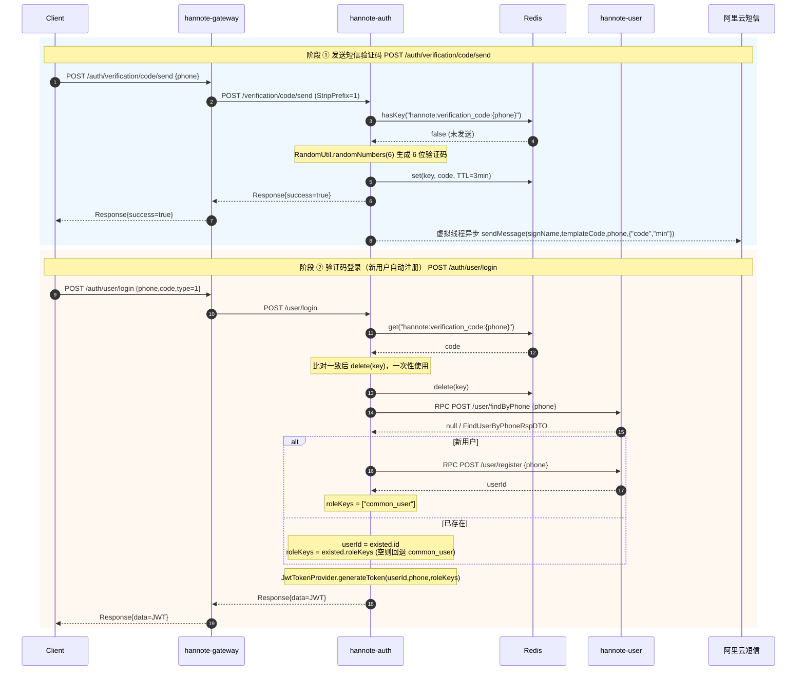
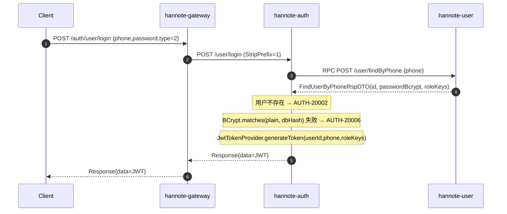
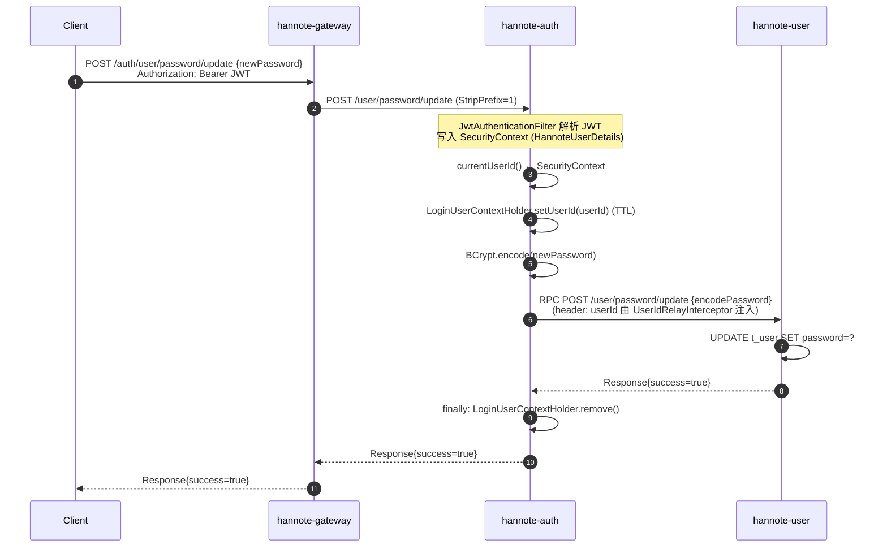
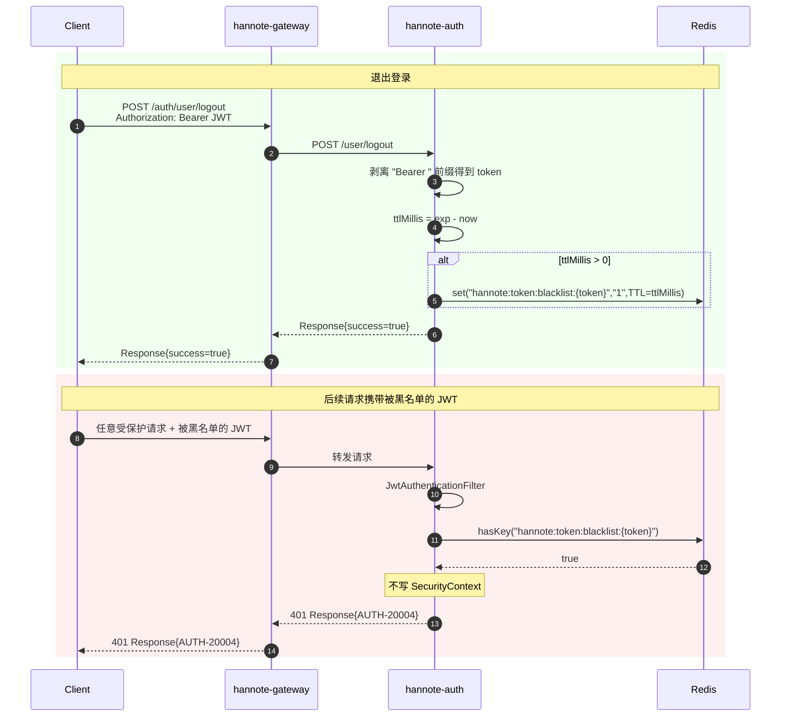

# hannote-auth 认证服务

> 服务端口 `8080`，Nacos 注册名 `hannote-auth`（namespace=`hannote`，group=`DEFAULT_GROUP`）。
> 本服务**不连数据库**，所有用户数据读写通过 RPC 调用 `hannote-user`；自身仅依赖 Redis（验证码 + JWT 登出黑名单）与阿里云短信。

---

## 1. 模块结构

```
hannote-auth/
├── Dockerfile
├── pom.xml
└── src/main/
    ├── java/com/hanserwei/auth/
    │   ├── HannoteAuthApplication.java           # 启动入口
    │   ├── config/
    │   │   ├── JacksonConfig.java                # Jackson 3 JsonMapper
    │   │   ├── JwtProperties.java                # JWT 配置（secret / expiration）
    │   │   ├── RedisTemplateConfig.java          # RedisTemplate（String key + Jackson 3 value）
    │   │   ├── RpcClientConfig.java              # @ImportHttpServices 注册 UserHttpApi
    │   │   ├── SecurityConfig.java               # Spring Security 7 过滤链
    │   │   └── ThreadPoolConfig.java             # 虚拟线程执行器（短信异步发送）
    │   ├── constant/
    │   │   ├── AuthConstants.java                # COMMON_USER_ROLE_KEY
    │   │   └── RedisKeyConstants.java            # Redis Key 常量
    │   ├── controller/
    │   │   ├── AuthController.java               # /user/login、/user/password/update、/user/logout
    │   │   └── VerificationCodeController.java   # /verification/code/send
    │   ├── enums/
    │   │   ├── LoginTypeEnum.java                # 1=验证码 2=密码
    │   │   └── ResponseCodeEnum.java             # AUTH-xxxxx 错误码
    │   ├── exception/
    │   │   └── GlobalExceptionHandler.java       # 全局异常兜底
    │   ├── model/vo/
    │   │   ├── user/                             # UserLoginReqVO / UpdatePasswordReqVO
    │   │   └── verificationcode/                 # SendVerificationCodeReqVO
    │   ├── rpc/
    │   │   └── UserRpcService.java               # 对 UserHttpApi 的薄封装
    │   ├── security/
    │   │   ├── HannoteUserDetails.java           # UserDetails 实现
    │   │   ├── JwtAuthenticationFilter.java      # OncePerRequestFilter
    │   │   └── JwtTokenProvider.java             # JJWT 签发 / 解析
    │   ├── service/
    │   │   ├── AuthService.java
    │   │   ├── VerificationCodeService.java
    │   │   └── impl/
    │   │       ├── AuthServiceImpl.java
    │   │       └── VerificationCodeServiceImpl.java
    │   └── sms/
    │       ├── AliyunAccessKeyProperties.java    # @ConfigurationProperties("aliyun")
    │       ├── AliyunSmsClientConfig.java        # 阿里云 SMS Client Bean
    │       └── AliyunSmsHelper.java              # sendSmsVerifyCodeWithOptions 封装
    └── resources/
        ├── application.yml                       # port / name / profiles
        ├── application-dev.yml                   # 本地凭据（gitignore）
        ├── application-dev.yml.example           # 模板
        ├── application-prod.yml                  # 环境变量注入
        └── logback-spring.xml
```

### 关键依赖（pom.xml）

| 依赖 | 用途 |
|---|---|
| `hannote-common` | `Response<T>`、`BizException`、`JsonUtils`、`@PhoneNumber` 等 |
| `hannote-spring-boot-starter-biz-operationlog` | `@ApiOperationLog` AOP |
| `hannote-spring-boot-starter-biz-context` | `LoginUserContextHolder`（TTL） |
| `hannote-spring-boot-starter-rpc` | HTTP Interface + LoadBalancer + `UserIdRelayInterceptor` |
| `hannote-user-api` | `UserHttpApi` 契约（`register` / `findByPhone` / `updatePassword`） |
| `spring-boot-starter-security` | 过滤链、会话策略、401/403 处理 |
| `spring-boot-starter-data-redis` + `commons-pool2` | Lettuce 连接池 |
| `jjwt-api / jjwt-impl / jjwt-jackson` | JJWT，HS256 签发 |
| `dypnsapi20170525` | 阿里云短信 SDK |
| `spring-cloud-starter-alibaba-nacos-discovery` | Nacos 注册 |

---

## 2. 接口清单

| # | Method | Path | 访问 | Controller 方法 | 说明 |
|---|---|---|---|---|---|
| 1 | POST | `/verification/code/send` | 公开 | `VerificationCodeController.send` | 发送短信验证码（含 3 分钟冷却） |
| 2 | POST | `/user/login` | 公开 | `AuthController.login` | 验证码 / 密码登录，验证码登录新用户自动注册 |
| 3 | POST | `/user/password/update` | 需 JWT | `AuthController.updatePassword` | 修改密码（BCrypt 加密后 RPC 落库） |
| 4 | POST | `/user/logout` | 需 JWT | `AuthController.logout` | 将当前 JWT 加入黑名单 |

> 网关路由：`/auth/**` → `hannote-auth`，`StripPrefix=1`，因此客户端实际调用路径为 `/auth/user/login`、`/auth/verification/code/send` 等。

---

## 3. 接口详情

### 3.1 `POST /verification/code/send` — 发送短信验证码

**请求体**：`SendVerificationCodeReqVO`
- `phone`：`@NotBlank` + `@PhoneNumber`（11 位数字）

**响应**：`Response<?>`，`success=true`

**调用链**：
```
VerificationCodeController.send
  └─ VerificationCodeServiceImpl.send
       ├─ Redis.hasKey("hannote:verification_code:{phone}") → 存在则抛 AUTH-20000
       ├─ RandomUtil.randomNumbers(6)                       → 生成 6 位验证码
       ├─ taskExecutor.execute(async)                       → 虚拟线程异步发送
       │     └─ AliyunSmsHelper.sendMessage(signName, templateCode, phone,
       │                                       {"code":"xxxxxx","min":"3"})
       │           └─ 阿里云 SDK client.sendSmsVerifyCodeWithOptions
       └─ Redis.set("hannote:verification_code:{phone}", code, 3 min)
```

**要点**：
- 冷却与 TTL 共用同一个 Key（Key 未过期 = 冷却中），3 分钟冷却 = 3 分钟有效期。
- 短信发送采用 **fire-and-forget**：异常仅记录日志，不影响主流程；响应返回时验证码已写入 Redis。
- 异步执行器为 `VirtualThreadTaskExecutor`（线程前缀 `AuthExecutor-`），由 `ThreadPoolConfig` 注册。

### 3.2 `POST /user/login` — 登录（新用户自动注册）

**请求体**：`UserLoginReqVO`
- `phone`：`@NotBlank` + `@PhoneNumber`
- `code`：验证码（type=1 必填）
- `password`：密码（type=2 必填）
- `type`：`@NotNull`，1=验证码 / 2=密码

**响应**：`Response<String>`，`data` 为 JWT

**调用链（验证码登录，type=1）**：
```
AuthController.login
  └─ AuthServiceImpl.loginAndRegister
       ├─ LoginTypeEnum.of(type)                              → VERIFICATION_CODE
       ├─ Redis.get("hannote:verification_code:{phone}")      → 不匹配抛 AUTH-20001
       ├─ Redis.delete(key)                                   → 一次性使用
       ├─ UserRpcService.findUserByPhone(phone)               → RPC hannote-user
       │     ├─ 不存在：UserRpcService.registerUser(phone)    → 自动注册
       │     │         注册失败（返回 null）抛 AUTH-20007
       │     │         roleKeys = ["common_user"]
       │     └─ 存在：userId = existed.id
       │              roleKeys = existed.roleKeys（空则回退 "common_user"）
       └─ JwtTokenProvider.generateToken(userId, phone, roleKeys)
```

**调用链（密码登录，type=2）**：
```
AuthController.login
  └─ AuthServiceImpl.loginAndRegister
       ├─ LoginTypeEnum.of(type)                              → PASSWORD
       ├─ UserRpcService.findUserByPhone(phone)               → 不存在抛 AUTH-20002
       ├─ PasswordEncoder.matches(password, dbBcrypt)         → 不匹配抛 AUTH-20006
       └─ JwtTokenProvider.generateToken(userId, phone, roleKeys)
```

**要点**：
- 验证码比对使用 `String.valueOf(cachedCode)` 防止 Redis 序列化类型差异。
- 验证码登录自带「自动注册」语义，前端无需单独调用注册接口。
- 密码登录要求用户**已存在**（由验证码登录先行注册，或后台初始化）。
- 角色列表 `roleKeys` 缺失时回退默认 `common_user`（`AuthConstants.COMMON_USER_ROLE_KEY`）。

### 3.3 `POST /user/password/update` — 修改密码

**请求体**：`UpdatePasswordReqVO`
- `newPassword`：`@NotBlank`

**响应**：`Response<?>`，`success=true`

**调用链**：
```
JwtAuthenticationFilter → 写入 SecurityContext
  └─ AuthController.updatePassword
       └─ AuthServiceImpl.updatePassword
            ├─ currentUserId()                                    → SecurityContext
            ├─ LoginUserContextHolder.setUserId(userId)           → 桥接 RPC 上下文
            ├─ PasswordEncoder.encode(newPassword)                → BCrypt
            ├─ UserRpcService.updatePassword(encodedPassword)     → RPC hannote-user
            │     （UserIdRelayInterceptor 将 userId 注入请求头）
            └─ finally: LoginUserContextHolder.remove()
```

**要点**：
- 本服务直连调用（不经网关），没有网关注入的 `userId` 头，因此必须显式桥接 `SecurityContext → LoginUserContextHolder`，由 RPC 出站拦截器补上请求头。
- 必须在 `finally` 中清理 TTL，避免虚拟线程复用导致串号。

### 3.4 `POST /user/logout` — 退出登录

**请求头**：`Authorization: Bearer <jwt>`

**响应**：`Response<?>`，`success=true`

**调用链**：
```
AuthController.logout
  ├─ 剥离 "Bearer " 前缀得到 token
  └─ AuthServiceImpl.logout(token)
       ├─ token 空白 → 直接成功
       ├─ JwtTokenProvider.getExpiration(token) → exp
       ├─ ttlMillis = exp - now
       └─ ttlMillis > 0 时 Redis.set("hannote:token:blacklist:{token}", "1", ttlMillis)
```

**要点**：
- JWT 无状态，登出采用「黑名单 + TTL 对齐剩余有效期」方案，TTL 一到自动清理，无需后台任务。
- 已过期令牌无需写黑名单，直接成功。
- 后续请求命中黑名单时 `JwtAuthenticationFilter` 不写 `SecurityContext`，由 Spring Security 返回 401。

---

## 4. 数据流转链路

### 4.1 短信登录（完整链路）



### 4.2 密码登录



### 4.3 修改密码



### 4.4 退出登录 + 后续鉴权



---

## 5. 安全层

### 5.1 `SecurityConfig`

- **关闭**：CSRF、表单登录、HTTP Basic。
- **会话策略**：`STATELESS`。
- **放行**：
  - `POST /verification/code/send`
  - `POST /user/login`
- **其余**：`anyRequest().authenticated()`。
- **异常处理**：
  - `authenticationEntryPoint` → 401 + `Response.fail(AUTH-20004)`
  - `accessDeniedHandler` → 403 + `Response.fail("AUTH-403", "无权访问该资源")`
- **自定义过滤器**：`JwtAuthenticationFilter` 注册在 `UsernamePasswordAuthenticationFilter` 之前。
- **`PasswordEncoder`**：`BCryptPasswordEncoder`。

### 5.2 `JwtAuthenticationFilter`

`OncePerRequestFilter` 逻辑：
1. 取 `Authorization` 头，要求 `Bearer ` 前缀。
2. Redis 黑名单命中 → 跳过。
3. `JwtTokenProvider.validate(token)` 成功 → 解析 `userId / phone / roles`。
4. 构造 `HannoteUserDetails(userId, phone, null, roles)` → `UsernamePasswordAuthenticationToken` → `SecurityContextHolder`。
5. 任何异常仅记录日志，过滤链继续执行。

### 5.3 `JwtTokenProvider`（JJWT）

- **算法**：HS256（HMAC-SHA256）。
- **签名密钥**：`Keys.hmacShaKeyFor(secret.getBytes(UTF_8))`，`secret` 由 `JwtProperties` 注入，`@PostConstruct` 校验长度 ≥ 32 字节。
- **缓存**：`volatile SecretKey signingKey` + `volatile JwtParser jwtParser`，双重检查锁懒加载。
- **载荷**：
  ```json
  { "sub":"<userId>", "phone":"...", "roles":["common_user"], "iat":..., "exp":... }
  ```
- **有效期**：`jwtProperties.expiration * 1000L`，默认 `2592000s = 30 天`。

### 5.4 `HannoteUserDetails`

- 实现 `UserDetails`，字段 `userId / phone / password / roles`。
- `getAuthorities()`：`roles → SimpleGrantedAuthority("ROLE_" + role)`。
- `getUsername()`：返回 `phone`。

---

## 6. RPC 客户端

### 6.1 注册

```java
// RpcClientConfig.java
@ImportHttpServices(group = UserApiConstants.SERVICE_NAME, types = UserHttpApi.class)
```

- `UserApiConstants.SERVICE_NAME = "hannote-user"`。
- RPC starter 自动装配 `baseUrl = lb://hannote-user`（Nacos 负载均衡）。
- 出站拦截器 `UserIdRelayInterceptor` 从 `LoginUserContextHolder` 读取 `userId` 并写入 HTTP 请求头。

### 6.2 调用矩阵

| AuthService 方法 | UserHttpApi 方法 | HTTP | 路径 | 入参 DTO | 出参 |
|---|---|---|---|---|---|
| `loginAndRegister` (type=1/2) | `findByPhone` | POST | `/user/findByPhone` | `FindUserByPhoneReqDTO(phone)` | `FindUserByPhoneRspDTO(id, password, roleKeys, ...)` |
| `loginAndRegister` (新用户) | `register` | POST | `/user/register` | `RegisterUserReqDTO(phone)` | `Long` userId |
| `updatePassword` | `updatePassword` | POST | `/user/password/update` | `UpdateUserPasswordReqDTO(encodePassword)` | `Response<?>` |

`UserRpcService` 封装规则：调用后判断 `response.isSuccess()`，失败/为空返回 `null`；`updatePassword` 不关心返回值。

---

## 7. Redis 键

| Key | Value | TTL | 写入点 | 读取点 |
|---|---|---|---|---|
| `hannote:verification_code:{phone}` | 6 位数字验证码（String） | 3 min | `VerificationCodeServiceImpl.send` | `AuthServiceImpl.loginAndRegister`（get + delete） |
| `hannote:token:blacklist:{jwt}` | `"1"` | 令牌剩余有效期 | `AuthServiceImpl.logout` | `JwtAuthenticationFilter.doFilterInternal` |

> 命名空间统一为 `hannote:`，与项目其他服务保持一致。

---

## 8. 错误码（`AUTH-xxxxx`）

| 枚举 | 错误码 | 文案 | 触发场景 |
|---|---|---|---|
| `SYSTEM_ERROR` | `AUTH-10000` | 出错啦，后台小哥正在努力修复中... | `GlobalExceptionHandler` 兜底未知 `Exception` |
| `PARAM_NOT_VALID` | `AUTH-10001` | 参数错误 | `MethodArgumentNotValidException`（Bean Validation 失败） |
| `VERIFICATION_CODE_SEND_FREQUENTLY` | `AUTH-20000` | 请求太频繁，请3分钟后再试 | 3 分钟冷却内再次发送验证码 |
| `VERIFICATION_CODE_ERROR` | `AUTH-20001` | 验证码错误 | 验证码不匹配或已过期 |
| `USER_NOT_FOUND` | `AUTH-20002` | 用户不存在 | 密码登录时手机号未注册 |
| `LOGIN_TYPE_NOT_SUPPORT` | `AUTH-20003` | 暂不支持该登录方式 | `type` 不是 1/2 |
| `UNAUTHORIZED` | `AUTH-20004` | 未登录或登录已过期 | 401 入口 + `currentUserId()` 上下文缺失 |
| `ACCOUNT_DISABLED` | `AUTH-20005` | 账号已被禁用 | **已定义，当前未使用** |
| `PHONE_OR_PASSWORD_ERROR` | `AUTH-20006` | 手机号或密码错误 | BCrypt 比对失败 |
| `LOGIN_FAIL` | `AUTH-20007` | 登录失败 | 自动注册 RPC 返回 `null` userId |

另有 `SecurityConfig.accessDeniedHandler` 使用硬编码 `AUTH-403 / 无权访问该资源`。

---

## 9. 关键类索引

| 类 | 说明 |
|---|---|
| `HannoteAuthApplication` | `@SpringBootApplication` + `@EnableDiscoveryClient` 启动入口 |
| `AuthController` | 登录 / 改密 / 登出 三端点 |
| `VerificationCodeController` | 短信验证码发送端点 |
| `AuthServiceImpl` | 登录（含自动注册）/ 改密 / 登出 业务实现 |
| `VerificationCodeServiceImpl` | 验证码冷却、生成、异步发送、缓存 |
| `SecurityConfig` | Spring Security 7 过滤链配置 |
| `JwtAuthenticationFilter` | Bearer 令牌解析 + 黑名单校验 |
| `JwtTokenProvider` | JJWT HS256 签发 / 解析，缓存 `SecretKey` 与 `JwtParser` |
| `JwtProperties` | `hannote.jwt.{secret,expiration}`，`@PostConstruct` 校验 secret |
| `HannoteUserDetails` | `UserDetails` 实现，承载 `userId/phone/roles` |
| `UserRpcService` | 对 `UserHttpApi` 的薄封装，解包 `Response<T>` |
| `RpcClientConfig` | `@ImportHttpServices(group="hannote-user", types=UserHttpApi.class)` |
| `RedisKeyConstants` | 验证码 / 黑名单 Key 构建 |
| `AuthConstants` | `COMMON_USER_ROLE_KEY = "common_user"` |
| `ResponseCodeEnum` | `AUTH-xxxxx` 错误码枚举 |
| `LoginTypeEnum` | `VERIFICATION_CODE(1)` / `PASSWORD(2)` |
| `AliyunSmsHelper` | 阿里云 SDK `sendSmsVerifyCodeWithOptions` 封装 |
| `AliyunSmsClientConfig` | 阿里云 `Client` Bean |
| `AliyunAccessKeyProperties` | `@ConfigurationProperties("aliyun")` |
| `ThreadPoolConfig` | `VirtualThreadTaskExecutor` Bean（`AuthExecutor-`） |
| `RedisTemplateConfig` | `RedisTemplate<String,Object>`（String key + Jackson 3 JSON value） |
| `JacksonConfig` | Jackson 3 `JsonMapper` 并同步到 `JsonUtils` |
| `GlobalExceptionHandler` | `BizException` / `MethodArgumentNotValidException` / `Exception` 兜底 |

---

## 10. 配置项

### `application.yml`
```yaml
server:
  port: 8080
spring:
  application:
    name: hannote-auth
  profiles:
    active: dev
```

### `application-dev.yml`（关键片段）
```yaml
spring.cloud.nacos.discovery:
  server-addr: <nacos>:18848
  namespace: hannote
  group: DEFAULT_GROUP
spring.data.redis:
  host: <redis>
  port: 6379
  password: <pwd>
  lettuce.pool: { max-active: 200, max-idle: 10 }
aliyun:
  access-key-id: <ak>
  access-key-secret: <sk>
  sms:
    sign-name: 恒创联众
    template-code: 100001
hannote.jwt:
  secret: <至少 32 字节>
  expiration: 2592000    # 30 天
```

### `application-prod.yml`

所有敏感项通过环境变量注入：`NACOS_ADDR`、`REDIS_HOST`、`REDIS_PORT`、`REDIS_PASSWORD`、`ALIYUN_ACCESS_KEY_ID`、`ALIYUN_ACCESS_KEY_SECRET`、`ALIYUN_SMS_SIGN_NAME`、`ALIYUN_SMS_TEMPLATE_CODE`、`JWT_SECRET`。

---

## 11. 设计备注

- **无数据库**：认证服务仅负责「凭据校验 + 令牌签发 / 失效」，用户数据（含密码、角色）归属 `hannote-user`。
- **无独立注册接口**：注册语义内嵌于验证码登录，降低前端流程复杂度。
- **无 Token 刷新**：JWT 有效期 30 天，过期重新登录；若后续接入刷新机制，建议新增 `refresh_token` 并独立黑名单。
- **无多端登录管理**：当前仅支持「按令牌登出」，不支持「按用户踢下线」；若需支持，需新增 `userId → Set<token>` 索引。
- **无图形验证码 / 行为验证**：短信接口仅靠 3 分钟冷却防刷，后续可接入图形验证码或腾讯云天御等风控。
- **`AUTH-20005` 账号禁用**：已预留错误码，但当前登录流程未查询账号状态字段，启用需在 `FindUserByPhoneRspDTO` 增补 `status` 并在登录分支校验。
- **RPC 上下文桥接**：`updatePassword` 必须显式 `SecurityContext → LoginUserContextHolder`，是因为本服务直连 `hannote-user` 而非经网关，没有网关注入的 `userId` 头。
- **`spring-retry` 警示**：本服务当前**未引入** `spring-retry`；若未来引入，必须在配置中显式 `spring.cloud.loadbalancer.retry.enabled: false`，否则 rpc starter 所需的 `LoadBalancerInterceptor` 将被替换为 `RetryLoadBalancerInterceptor` 导致启动失败（详见 `AGENTS.md` 中 `hannote-comment` 的教训）。
