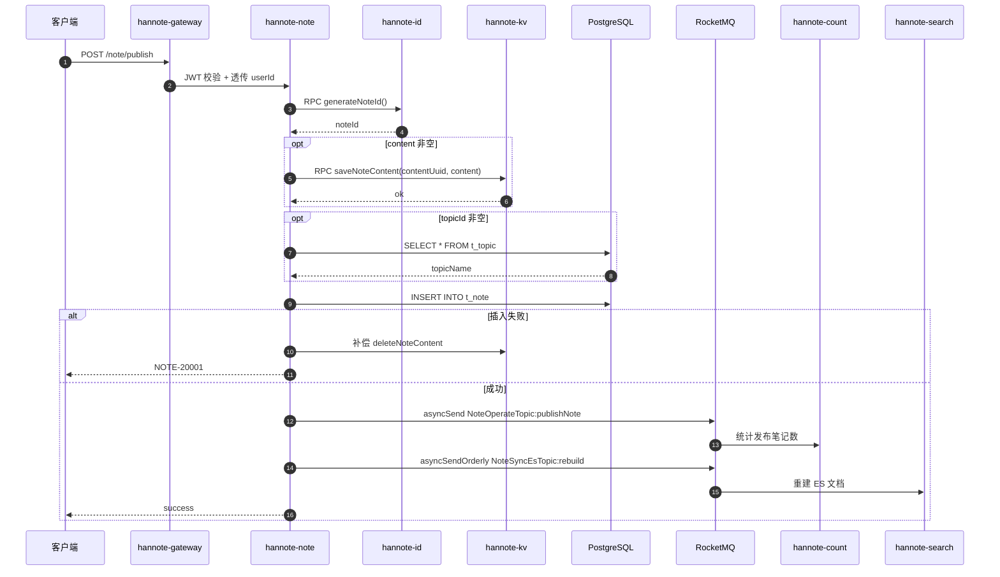
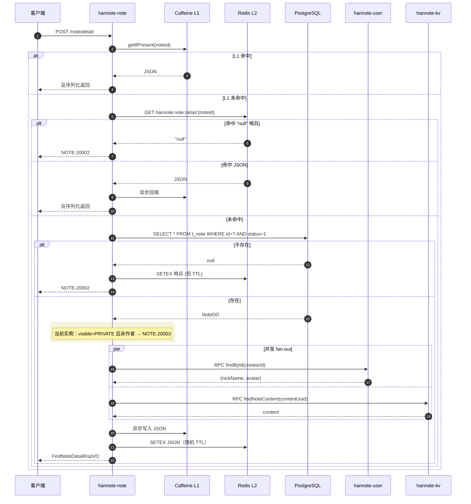
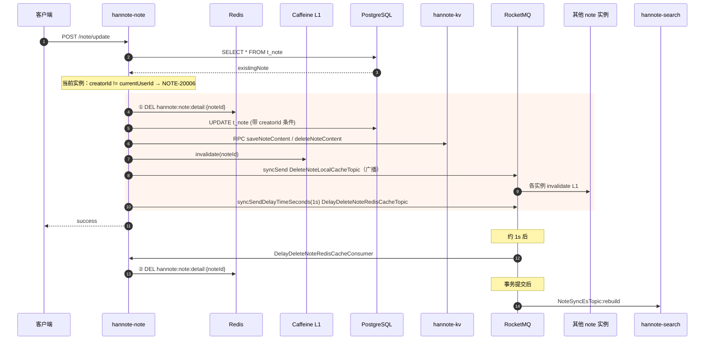
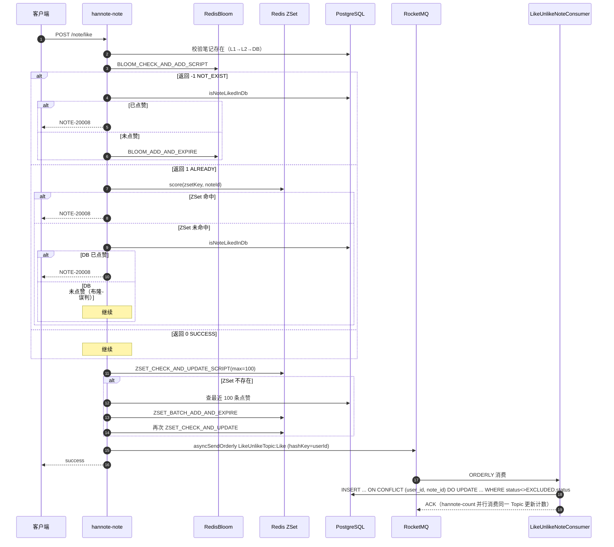
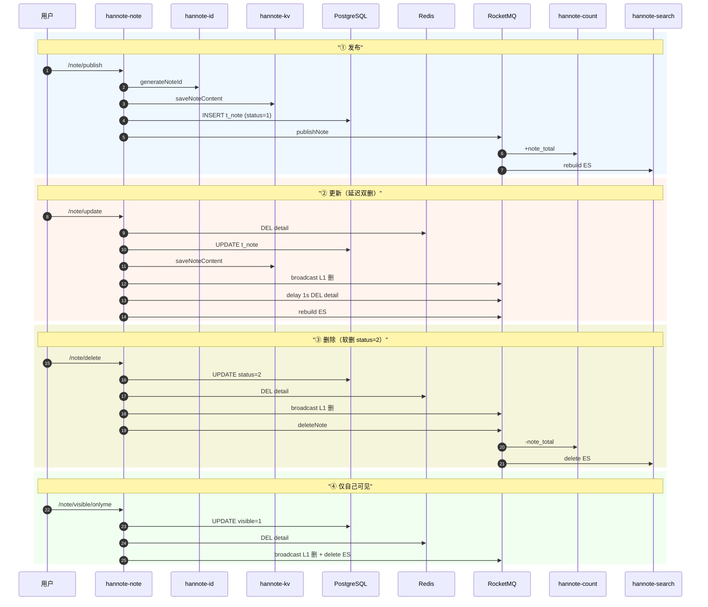
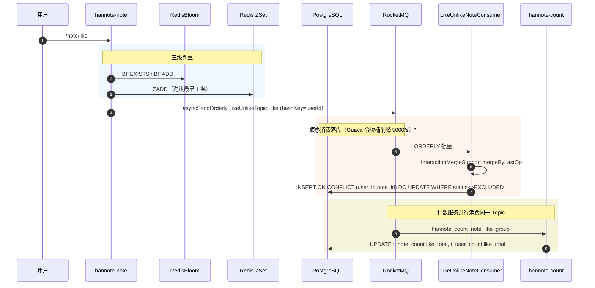
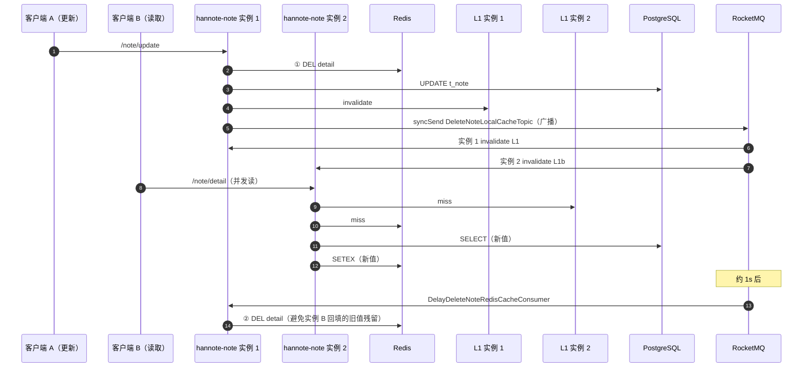

# hannote-note 笔记服务

> 服务端口 `8085`，Nacos 注册名 `hannote-note`（namespace=`hannote`，group=`DEFAULT_GROUP`）。
> 本服务是 `t_channel` / `t_topic` / `t_channel_topic_rel` / `t_note` / `t_note_like` / `t_note_collection` 六张表的**唯一属主**，承担频道/话题/笔记的发布、查询、更新、删除、可见性、置顶以及点赞/收藏等核心业务。
> 正文存储、用户资料、分布式 ID 生成、计数统计、搜索同步均通过 RPC 或 MQ 与其他服务协同完成。

---

## 1. 模块结构

```
hannote-note/
├── pom.xml                                  # 聚合 POM（packaging=pom）
├── hannote-note-api/                        # 纯契约模块（jar，供其他服务依赖）
│   └── src/main/java/com/hanserwei/note/api/
│       ├── NoteHttpApi.java                 # @HttpExchange 接口（findPublishedById）
│       ├── constant/NoteApiConstants.java   # SERVICE_NAME = "hannote-note"
│       └── dto/{req,resp}/*.java            # FindPublishedNoteReqDTO / RspDTO
└── hannote-note-biz/                        # 可运行 Spring Boot 应用（jar）
    ├── Dockerfile                           # 多阶段构建：maven 3.9 + JDK 25 → JRE 25 Alpine
    └── src/main/java/com/hanserwei/note/
        ├── HannoteNoteApplication.java      # @SpringBootApplication + @MapperScan
        ├── config/
        │   ├── AsyncConfig.java             # noteTaskExecutor（虚拟线程）
        │   ├── JacksonConfig.java           # Jackson 3 JsonMapper
        │   ├── RedisTemplateConfig.java     # RedisTemplate（String key + Jackson 3 JSON value）
        │   └── RpcClientConfig.java         # @ImportHttpServices 注册 user / kv / id 服务
        ├── constant/
        │   ├── MQConstants.java             # RocketMQ Topic / Tag / Group
        │   └── RedisKeyConstants.java       # Redis Key 常量
        ├── controller/NoteController.java   # 11 个 POST 端点
        ├── consumer/
        │   ├── DeleteNoteLocalCacheConsumer.java        # 广播删 L1
        │   ├── DelayDeleteNoteRedisCacheConsumer.java   # 延时二次删 Redis
        │   ├── LikeUnlikeNoteConsumer.java              # 顺序消费落 t_note_like
        │   └── CollectUnCollectNoteConsumer.java        # 顺序消费落 t_note_collection
        ├── domain/
        │   ├── dataobject/                  # ChannelDO / TopicDO / ChannelTopicRelDO / NoteDO / NoteLikeDO / NoteCollectionDO
        │   └── mapper/                      # 6 个 Mapper + 3 个 XML
        ├── enums/
        │   ├── ResponseCodeEnum.java        # NOTE-xxxxx 错误码
        │   ├── NoteTypeEnum / NoteStatusEnum / NoteVisibleEnum
        │   ├── LikeUnlikeNoteTypeEnum / CollectUnCollectNoteTypeEnum
        │   ├── NoteBloomAddResultEnum / NoteBloomCheckResultEnum
        │   └── NoteOperateEnum
        ├── exception/GlobalExceptionHandler.java
        ├── model/
        │   ├── dto/                         # MQ 消息体 DTO
        │   └── vo/                          # 11 个 Req/Rsp VO
        ├── rpc/
        │   ├── UserRpcService.java          # 对 UserHttpApi 的封装
        │   ├── KeyValueRpcService.java      # 对 KeyValueHttpApi 的封装
        │   └── DistributedIdRpcService.java # 对 DistributedIdHttpApi 的封装
        └── service/{NoteService,impl/NoteServiceImpl}.java
```

### 关键依赖（`hannote-note-biz/pom.xml`）

| 依赖 | 用途 |
|---|---|
| `hannote-note-api` | 自身契约（Controller 实现 `@PostExchange` 路径） |
| `hannote-user-api` | `UserHttpApi`（笔记详情拼装作者昵称/头像） |
| `hannote-kv-api` | `KeyValueHttpApi`（正文存取，底层 ScyllaDB） |
| `hannote-distributed-id-generator-api` | `DistributedIdHttpApi`（生成 `note_id`） |
| `hannote-spring-boot-starter-rpc` | HTTP Interface + LoadBalancer + `UserIdRelayInterceptor` |
| `hannote-spring-boot-starter-biz-context` | `LoginUserContextHolder`（TTL） |
| `hannote-spring-boot-starter-biz-operationlog` | `@ApiOperationLog` AOP |
| `hannote-common` | `InteractionMergeSupport`（MQ 消息按 `(userId,noteId)` 合并） |
| `mybatis-plus-spring-boot4-starter` + `postgresql` | PG 持久化 |
| `spring-boot-starter-data-redis` + `commons-pool2` | Lettuce 连接池 |
| `rocketmq-spring-boot-starter`（2.3.6） | 4 个 Topic 生产 / 4 个消费者 |
| `caffeine` | L1 本地缓存 |

---

## 2. 接口清单

| # | Method | Path | 访问 | Controller 方法 | 说明 |
|---|---|---|---|---|---|
| 1 | POST | `/note/publish` | 网关暴露（JWT） | `publishNote` | 发布图文/视频笔记 |
| 2 | POST | `/note/detail` | 网关暴露（JWT） | `findNoteDetail` | 笔记详情（L1+L2+DB） |
| 3 | POST | `/note/update` | 网关暴露（JWT） | `updateNote` | 更新笔记（仅作者，延迟双删） |
| 4 | POST | `/note/delete` | 网关暴露（JWT） | `deleteNote` | 软删除（status=2） |
| 5 | POST | `/note/visible/onlyme` | 网关暴露（JWT） | `visibleOnlyMe` | 设为仅自己可见 |
| 6 | POST | `/note/top` | 网关暴露（JWT） | `topNote` | 置顶/取消置顶 |
| 7 | POST | `/note/like` | 网关暴露（JWT） | `likeNote` | 点赞（布隆 + ZSet + DB） |
| 8 | POST | `/note/unlike` | 网关暴露（JWT） | `unlikeNote` | 取消点赞 |
| 9 | POST | `/note/collect` | 网关暴露（JWT） | `collectNote` | 收藏 |
| 10 | POST | `/note/uncollect` | 网关暴露（JWT） | `unCollectNote` | 取消收藏 |
| 11 | POST | `/note/findPublishedById` | 内网 RPC | `findPublishedById` | 校验笔记已发布（供 comment/search 调用） |

> 网关路由：`/note/**` → `hannote-note`，`StripPrefix=1`。除 `findPublishedById` 外，其余 10 个接口均经网关，需携带 JWT；`userId` 由网关透传到 `userId` 请求头，下游 `HeaderUserId2ContextFilter` 写入 `LoginUserContextHolder`。

---

## 3. 接口详情

### 3.1 `POST /note/publish` — 发布笔记

**请求**：`PublishNoteReqVO`（JSON）
- `title`（`String`）、`content`（`String`，可空）
- `type`（`Integer`：0 图文 / 1 视频）
- `imgUris`（`List<String>`，图文必填且 ≤ 8）
- `videoUri`（`String`，视频必填）
- `topicId`（`Long`，可空）

**响应**：`Response<?>`

**调用链**：
```
NoteController.publishNote
  └─ NoteServiceImpl.publishNote
       ├─ NoteTypeEnum.of(type)                                  → 失败抛 NOTE-20000
       ├─ Preconditions 校验 imgUris / videoUri                   → 失败抛 NOTE-10001
       ├─ DistributedIdRpcService.generateNoteId()                → 失败抛 NOTE-20001
       ├─ content 非空：UUID.randomUUID() → KeyValueRpcService.saveNoteContent
       ├─ topicId 非空：TopicDOMapper.selectById                  → 失败抛 NOTE-20005
       ├─ 构造 NoteDO（id/type/imgUris/videoUri/contentUuid/...）
       ├─ NoteDOMapper.insert(noteDO)
       │    └─ 失败时补偿：KeyValueRpcService.deleteNoteContent   → 抛 NOTE-20001
       ├─ sendNoteOperateMq(PUBLISH)                              → NoteOperateTopic:publishNote
       └─ sendNoteSyncEsMqAfterCommit(rebuild)                    → NoteSyncEsTopic:rebuild
```

**要点**：
- 笔记 ID 来自分布式 ID 服务（生成器 `note_id`，`IdType.INPUT`），非数据库自增。
- 正文存 ScyllaDB（经 `hannote-kv`），元数据存 PG，**两次写非事务**：PG 失败时补偿删除 KV 正文避免孤儿。
- `publishNote` 不在 `@Transactional` 内，`sendNoteSyncEsMqAfterCommit` 走直接发送（无事务同步器注册）。
- MQ 通知 `hannote-count` 统计「发布笔记数」、通知 `hannote-search` 重建 ES 文档。



### 3.2 `POST /note/detail` — 笔记详情

**请求**：`FindNoteDetailReqVO`（JSON）
- `noteId`（`Long`）

**响应**：`Response<FindNoteDetailRspVO>`（含作者昵称/头像、正文、图片 URI 列表等）

**调用链**：
```
NoteController.findNoteDetail
  └─ NoteServiceImpl.findNoteDetail
       ├─ L1：LOCAL_CACHE.getIfPresent(noteId)
       │    └─ 命中 → parseNoteDetail → checkNoteVisibleFromVO → 返回
       ├─ L2：redisTemplate.get(hannote:note:detail:{noteId})
       │    ├─ "null" 哨兵 → 异步写 L1 哨兵 → 抛 NOTE-20002
       │    └─ JSON → 异步回填 L1 → checkNoteVisible → 返回
       ├─ DB：selectPublishedNote (LambdaQueryWrapper, status=NORMAL)
       │    └─ 未命中 → 异步写 L2 哨兵（短 TTL）→ 抛 NOTE-20002
       ├─ checkNoteVisible(visible, userId, creatorId)             → PRIVATE 且非作者抛 NOTE-20003
       ├─ assembleNoteDetail(noteDO)
       │    └─ CompletableFuture.allOf（虚拟线程 noteTaskExecutor）
       │         ├─ UserRpcService.findById(creatorId)
       │         └─ KeyValueRpcService.findNoteContent(contentUuid)  → 仅当 contentEmpty=false
       ├─ 异步回填 L1 + L2（随机 TTL：1d + [0,1d)）
       └─ 返回 FindNoteDetailRspVO
```

**要点**：
- 三级缓存 L1（Caffeine 1 万 / 1h） → L2（Redis String，`GenericJacksonJsonRedisSerializer`） → DB。
- 防穿透：DB miss 后写 `"null"` 哨兵，TTL `60 + random(60)` 秒。
- 防雪崩：真实数据 TTL 随机化（`86400 + random(0..86400)` 秒）。
- 并发 fan-out：用户资料和正文通过 `CompletableFuture` 并行拉取，使用虚拟线程池避免阻塞平台线程。



### 3.3 `POST /note/update` — 更新笔记（延迟双删）

**请求**：`UpdateNoteReqVO`（JSON）
- `noteId`、`title`、`content`、`type`、`imgUris`、`videoUri`、`topicId`

**响应**：`Response<?>`

**调用链**（`@Transactional`）：
```
NoteController.updateNote
  └─ NoteServiceImpl.updateNote
       ├─ 校验 type / imgUris / videoUri
       ├─ NoteDOMapper.selectById(noteId)                          → null 抛 NOTE-20002
       ├─ existingNote.creatorId != currentUserId                  → 抛 NOTE-20006
       ├─ topicId 非空 → TopicDOMapper.selectById                  → 失败抛 NOTE-20005
       ├─ 计算 contentUuid（保留/新增 UUID）
       ├─ ① redisTemplate.delete(noteDetailKey)                    → 延迟双删 第 1 次
       ├─ LambdaUpdateWrapper 更新 t_note（PG）
       ├─ content 变更 → KeyValueRpcService.saveNoteContent / deleteNoteContent
       │    └─ 失败抛 NOTE-20004（事务回滚）
       ├─ broadcastDeleteLocalCache(noteId)
       │    ├─ LOCAL_CACHE.invalidate(noteId)
       │    └─ syncSend DeleteNoteLocalCacheTopic（广播）
       ├─ ② noteTaskExecutor → syncSendDelayTimeSeconds(DelayDeleteNoteRedisCacheTopic, 1s)
       └─ sendNoteSyncEsMqAfterCommit(rebuild)                     → 事务提交后发 ES 重建
```

**要点**：
- **归属校验**：`LambdaUpdateWrapper` 带 `eq(creatorId, currentUserId)`，变更 0 行时抛 `NOTE-20006`。
- **延迟双删**：
  1. 事务前删除 Redis（避免读请求在事务提交前回填旧数据）；
  2. 事务提交后 1s，由 `DelayDeleteNoteRedisCacheConsumer` 二次删除 Redis（清理事务期间可能被回填的脏缓存）。
- **L1 跨实例失效**：广播 `DeleteNoteLocalCacheTopic`（`MessageModel.BROADCASTING`），每个 `hannote-note` 实例均消费并 `LOCAL_CACHE.invalidate`。
- **事务内禁止 RPC**：`KeyValueRpcService` 在 PG 事务内调用是已知取舍（RPC 超时会导致 PG 长事务），失败抛异常回滚。



### 3.4 `POST /note/delete` — 软删除

**请求**：`DeleteNoteReqVO`（`noteId`）

**响应**：`Response<?>`

**调用链**（`@Transactional`）：
```
NoteController.deleteNote
  └─ NoteServiceImpl.deleteNote
       ├─ LambdaUpdateWrapper：eq(id).eq(creatorId).set(status=DELETED=2).set(updateTime)
       ├─ NoteDOMapper.update → count==0 抛 NOTE-20006
       ├─ redisTemplate.delete(noteDetailKey) + broadcastDeleteLocalCache(noteId)
       ├─ sendNoteOperateMq(DELETE)                               → NoteOperateTopic:deleteNote
       └─ sendNoteSyncEsMqAfterCommit(delete)                     → NoteSyncEsTopic:delete
```

**要点**：
- **业务软删**：使用 `status=2`（DELETED）而非框架 `@TableLogic`；`t_note` 无 `is_deleted` 字段。
- 归属校验直接拼在 `UPDATE WHERE` 中，变更 0 行即抛 `NOTE-20006`。
- MQ 通知 `hannote-count` 递减发布笔记数、`hannote-search` 删除 ES 文档。

### 3.5 `POST /note/visible/onlyme` — 仅自己可见

**请求**：`UpdateNoteVisibleOnlyMeReqVO`（`noteId`）

**响应**：`Response<?>`

**调用链**（`@Transactional`）：
```
NoteController.visibleOnlyMe
  └─ NoteServiceImpl.visibleOnlyMe
       ├─ LambdaUpdateWrapper：eq(id).eq(creatorId).eq(status=NORMAL).set(visible=PRIVATE)
       ├─ count==0 抛 NOTE-20007
       ├─ redisTemplate.delete(noteDetailKey) + broadcastDeleteLocalCache(noteId)
       └─ sendNoteSyncEsMqAfterCommit(delete)                    → 公开索引中移除
```

**要点**：
- 仅 `status=NORMAL(1)` 的笔记可设仅自己可见；其他状态变更 0 行抛 `NOTE-20007`。
- 设为私有后从 ES 公开索引中移除（Tag=`delete`），不再被 `/search/note` 命中。

### 3.6 `POST /note/top` — 置顶/取消置顶

**请求**：`TopNoteReqVO`（`noteId`、`isTop`）

**响应**：`Response<?>`

**调用链**（`@Transactional`）：
```
NoteController.topNote
  └─ NoteServiceImpl.topNote
       ├─ LambdaUpdateWrapper：eq(id).eq(creatorId).set(top=isTop).set(updateTime)
       ├─ count==0 抛 NOTE-20006
       ├─ redisTemplate.delete(noteDetailKey)
       └─ broadcastDeleteLocalCache(noteId)
```

**要点**：
- 不发 MQ（不触发 ES 重建、不影响计数）。
- 仅缓存失效。

### 3.7 `POST /note/like` — 点赞（布隆 + ZSet + DB 三级判重）

**请求**：`LikeNoteReqVO`（`noteId`）

**响应**：`Response<?>`

**调用链**：
```
NoteController.likeNote
  └─ NoteServiceImpl.likeNote
       ├─ checkNoteExistAndGetCreatorId(noteId)                   → L1→L2→DB，DB miss 抛 NOTE-20002
       ├─ bloomKey=hannote:note:bloom:like:{userId}
       │  zsetKey=hannote:note:zset:like:{userId}
       ├─ stringRedisTemplate.execute(BLOOM_CHECK_AND_ADD_SCRIPT, [bloomKey], noteId)
       │    ├─ -1 NOT_EXIST：DB 查询 isNoteLikedInDb
       │    │    ├─ true  → batchAddNoteLike2BloomAndExpire → 抛 NOTE-20008
       │    │    └─ false → BLOOM_ADD_AND_EXPIRE_SCRIPT 写入
       │    ├─ 1 ALREADY：ZSET score 校验
       │    │    ├─ 命中 → 抛 NOTE-20008
       │    │    └─ 未命中 → isNoteLikedInDb
       │    │         ├─ true  → asyncInitNoteLikeZSet → 抛 NOTE-20008
       │    │         └─ false → 视为布隆误判，继续
       │    └─ 0 SUCCESS：继续
       ├─ ZSET_CHECK_AND_UPDATE_SCRIPT（max=100）
       │    └─ -1 NOT_EXIST → initNoteLikeZSetAndAddCurrent（DB 回源最近 100 条）
       └─ sendLikeUnlikeMq(LIKE)                                  → asyncSendOrderly
             Topic: LikeUnlikeTopic:Like, hashKey=userId
```

**要点**：
- **三级判重**：布隆（高吞吐判「已存在」）→ ZSET（最近 100 条热数据）→ DB（最终裁决）。
- **布隆不支持删除**，故取消点赞走 `BLOOM_EXIST_SCRIPT` 只查询不移除；对布隆「已标记」的笔记，取消操作**幂等放行**，由下游 SQL `WHERE status <> EXCLUDED.status` 兜底。
- **顺序 MQ**：`hashKey=userId` 保证同一用户的事件顺序到达消费端，避免并发导致 `(userId,noteId)` 最终状态错乱。



### 3.8 `POST /note/unlike` — 取消点赞

**请求**：`UnlikeNoteReqVO`（`noteId`）

**响应**：`Response<?>`

**调用链**：
```
NoteController.unlikeNote
  └─ NoteServiceImpl.unlikeNote
       ├─ checkNoteExistAndGetCreatorId(noteId)
       ├─ stringRedisTemplate.execute(BLOOM_EXIST_SCRIPT, [bloomKey], noteId)
       │    ├─ -1 NOT_EXIST：asyncInitBloom + isNoteLikedInDb
       │    │    └─ false 抛 NOTE-20009
       │    ├─ 0 NOT_MARKED：抛 NOTE-20009
       │    └─ 1 MARKED：继续（可能误判，DB 兜底）
       ├─ opsForZSet().remove(zsetKey, noteId)
       └─ sendLikeUnlikeMq(UNLIKE)                                → LikeUnlikeTopic:Unlike
```

**要点**：
- 布隆「未标记」（返回 0）是**绝对真负**，可直接抛错；布隆「已标记」（返回 1）可能是误判，落库 SQL `WHERE status=1` 兜底。
- ZSET 移除是**尽力而为**：成员不存在时 `ZREM` 不报错，不阻塞后续 MQ 发送。

### 3.9 `POST /note/collect` / 3.10 `POST /note/uncollect` — 收藏

与 3.7 / 3.8 完全对称，仅替换以下元素：

| 项 | 点赞 | 收藏 |
|---|---|---|
| 布隆键 | `hannote:note:bloom:like:{userId}` | `hannote:note:bloom:collect:{userId}` |
| ZSet 键 | `hannote:note:zset:like:{userId}` | `hannote:note:zset:collect:{userId}` |
| ZSet 上限 | 100 | 300 |
| DB 表 | `t_note_like` | `t_note_collection` |
| MQ Topic | `LikeUnlikeTopic:Like/Unlike` | `CollectUnCollectTopic:Collect/UnCollect` |
| 错误码 | `NOTE-20008/20009` | `NOTE-20010/20011` |
| 消费组 | `hannote_note_like_unlike_group` | `hannote_note_collect_uncollect_group` |
| 计数 Topic（由 count 服务消费） | `CountNoteLikeTopic` | `CountNoteCollectTopic` |

### 3.11 `POST /note/findPublishedById` — 校验笔记已发布（RPC）

**请求**：`FindPublishedNoteReqDTO`（`noteId`）

**响应**：`Response<FindPublishedNoteRspDTO>`（`noteId`、`creatorId`）

**调用链**：
```
NoteController.findPublishedById
  └─ NoteServiceImpl.findPublishedById
       └─ noteDOMapper.selectPublishedById(noteId)
            → SELECT id AS note_id, creator_id FROM t_note WHERE id=? AND status=1
```

**要点**：
- 供 `hannote-comment`（发布评论前校验笔记存在）和 `hannote-search`（回源）等内网服务 RPC 调用。
- **不加 `@ApiOperationLog`**，避免日志序列化对高频 RPC 造成开销。
- 返回数据仅含 `noteId` / `creatorId`，不拼装详情。

---

## 4. 数据流转链路

### 4.1 笔记生命周期



### 4.2 点赞/收藏全链路



### 4.3 缓存一致性（延迟双删）



---

## 5. 缓存层

### 5.1 三级缓存

| 层 | 技术 | 容量/上限 | TTL | 写入点 | 读取点 |
|---|---|---|---|---|---|
| L1 | Caffeine（进程内） | 10,000 条 | 1h | `findNoteDetail` 异步回填 | `findNoteDetail`、`checkNoteExistAndGetCreatorId` |
| L2 | Redis String（`GenericJacksonJsonRedisSerializer`） | 无上限 | 真实：`86400 + random(0..86400)` s；哨兵：`60 + random(0..60)` s | `findNoteDetail` 异步回填；各变更接口删除 | 同上 |
| DB | PostgreSQL `t_note` | — | — | `publishNote` / `updateNote` / `deleteNote` / `visibleOnlyMe` / `topNote` | `findNoteDetail`、`checkNoteExistAndGetCreatorId` |

### 5.2 防穿透 / 防雪崩

- **防穿透**：DB miss 后写 `"null"` 哨兵（短 TTL），后续读直接抛 `NOTE-20002`，避免高并发下 DB 被打挂。
- **防雪崩**：真实数据 TTL 在 `1d ~ 2d` 区间随机，哨兵 TTL 在 `60s ~ 120s` 区间随机，避免大面积缓存同时失效。
- **空值哨兵写入**：使用虚拟线程池 `noteTaskExecutor` 异步写 L1，避免阻塞主路径。

### 5.3 跨实例 L1 失效

- 变更接口（update/delete/visibleOnlyMe/top）调用 `broadcastDeleteLocalCache(noteId)`：
  - 本实例 `LOCAL_CACHE.invalidate`；
  - `syncSend DeleteNoteLocalCacheTopic`（`MessageModel.BROADCASTING`），所有实例的 `DeleteNoteLocalCacheConsumer` 消费并 invalidate。

---

## 6. RocketMQ 链路

| # | Topic | Tag | 生产方 | 消费方 | 模式 | 说明 |
|---|---|---|---|---|---|---|
| 1 | `DeleteNoteLocalCacheTopic` | — | `NoteServiceImpl.broadcastDeleteLocalCache`（sync） | `DeleteNoteLocalCacheConsumer`（group=`hannote_group`） | **BROADCASTING** | 删各实例 L1 |
| 2 | `DelayDeleteNoteRedisCacheTopic` | — | `updateNote`（`syncSendDelayTimeSeconds(..., 1)`，5.x timer） | `DelayDeleteNoteRedisCacheConsumer`（group=`hannote_group_delay_delete_redis_cache`） | CLUSTERING | 延迟 1s 二次删 Redis |
| 3 | `LikeUnlikeTopic` | `Like` / `Unlike` | `likeNote` / `unlikeNote`（asyncSendOrderly，hashKey=userId） | `LikeUnlikeNoteConsumer`（group=`hannote_note_like_unlike_group`，ORDERLY）+ `hannote-count`（`hannote_count_note_like_group`） | CLUSTERING | 点赞/取消落 `t_note_like`；计数服务并行消费 |
| 4 | `CollectUnCollectTopic` | `Collect` / `UnCollect` | `collectNote` / `unCollectNote`（asyncSendOrderly，hashKey=userId） | `CollectUnCollectNoteConsumer`（group=`hannote_note_collect_uncollect_group`，ORDERLY）+ `hannote-count`（`hannote_count_note_collect_group`） | CLUSTERING | 收藏/取消落 `t_note_collection` |
| 5 | `NoteOperateTopic` | `publishNote` / `deleteNote` | `publishNote` / `deleteNote`（async） | `hannote-count`（`hannote_count_note_operate_group`） | CLUSTERING | 统计发布/删除笔记数 |
| 6 | `NoteSyncEsTopic` | `rebuild` / `delete` | `publishNote` / `updateNote`（事务后）/ `deleteNote` / `visibleOnlyMe`（asyncSendOrderly，hashKey=noteId） | `hannote-search.NoteSyncEsConsumer`（group=`hannote_search_note_sync_es_group`，ORDERLY） | CLUSTERING | 重建/删除 ES 文档 |

> `rocketmq-spring-boot-starter` 2.3.x 原生支持 Spring Boot 4 自动装配，**无需** `@Import(RocketMQAutoConfiguration.class)`。
> 延时消息使用 5.x **timer message** `syncSendDelayTimeSeconds(topic, body, 1)`（任意精度），非 4.x 的 18 级 `delayLevel`。

---

## 7. Redis 键

| Key | 类型 | TTL | 写入点 | 读取点 |
|---|---|---|---|---|
| `hannote:note:detail:{noteId}` | String（Jackson JSON，或哨兵 `"null"`） | 真实：`86400+rand(0..86400)` s；哨兵：`60+rand(0..60)` s | `findNoteDetail`（回填）；`DelayDeleteNoteRedisCacheConsumer` / 各变更接口（DEL） | `findNoteDetail`、`checkNoteExistAndGetCreatorId` |
| `hannote:note:bloom:like:{userId}` | RedisBloom | `86400+rand(0..86400)` s | `likeNote`（`BLOOM_CHECK_AND_ADD`/`BLOOM_ADD_AND_EXPIRE`/`BLOOM_BATCH_ADD_AND_EXPIRE`） | `likeNote`、`unlikeNote` |
| `hannote:note:bloom:collect:{userId}` | RedisBloom | 同上 | `collectNote` | `collectNote`、`unCollectNote` |
| `hannote:note:zset:like:{userId}` | ZSet（score=时间戳，member=noteId，上限 100） | 随机 | `likeNote`（`ZSET_CHECK_AND_UPDATE`/`ZSET_BATCH_ADD_AND_EXPIRE`） | `likeNote`（`ZSCORE`） |
| `hannote:note:zset:collect:{userId}` | ZSet（上限 300） | 随机 | `collectNote` | `collectNote` |

> **Lua 脚本专用 `StringRedisTemplate`**：避免 `RedisTemplate<String,Object>` 的 Jackson value 序列化污染脚本入参（与 `hannote-user-relation` 一致）。
> Redis 服务需加载 **RedisBloom 模块**（`bf`），否则 Lua 脚本调用 `BF.ADD` / `BF.EXISTS` 会报 `unknown command`。

### Lua 脚本清单（`src/main/resources/lua/`）

| 文件 | 用途 |
|---|---|
| `bloom_check_and_add.lua` | 布隆存在性检查 + 添加；返回 -1/0/1 |
| `bloom_exist.lua` | 布隆存在性只读查询；返回 -1/0/1 |
| `bloom_add_and_expire.lua` | 单条布隆写入 + 设置 TTL |
| `bloom_batch_add_and_expire.lua` | 批量布隆写入 + 设置 TTL（DB 回源时使用） |
| `zset_check_and_update.lua` | ZSet 容量校验 + ZPOPMIN 淘汰 + ZADD |
| `zset_batch_add_and_expire.lua` | 批量 ZADD + EXPIRE（DB 回源时使用） |

---

## 8. 数据表

> 全部归属 `hannote-note`，其他服务不直接访问。DDL 位于 `docs/sql/`。

| 表 | DO | PK 策略 | 关键字段 | 唯一索引 | 备注 |
|---|---|---|---|---|---|
| `t_channel` | `ChannelDO` | `IdType.INPUT` | `id, name, is_deleted` | — | `is_deleted` 为 PG 布尔（`@TableLogic`） |
| `t_topic` | `TopicDO` | `IdType.INPUT` | `id, name, is_deleted` | — | `is_deleted` 为 PG 布尔 |
| `t_channel_topic_rel` | `ChannelTopicRelDO` | `IdType.INPUT` | `id, channel_id, topic_id` | — | **无** `is_deleted`，物理删除 |
| `t_note` | `NoteDO` | `IdType.INPUT`（分布式 ID） | `id, title, is_content_empty, creator_id, topic_id, topic_name, is_top, type, img_uris, video_uri, visible, status, content_uuid, create_time, update_time` | — | **无** `@TableLogic`；`status` 为业务状态机（0=待审核 / 1=正常 / 2=已删除 / 3=已下架） |
| `t_note_like` | `NoteLikeDO` | `IdType.AUTO` | `id, user_id, note_id, create_time, status` | `uk_note_like_user_note (user_id, note_id)` | `status`：0 取消 / 1 有效 |
| `t_note_collection` | `NoteCollectionDO` | `IdType.AUTO` | `id, user_id, note_id, create_time, status` | `uk_note_collection_user_note (user_id, note_id)` | 同上 |

### 关键 XML SQL（`src/main/resources/mapper/`）

`NoteDOMapper.xml`：
```sql
SELECT creator_id FROM t_note WHERE id = #{noteId} AND status = 1
SELECT id AS note_id, creator_id FROM t_note WHERE id = #{noteId} AND status = 1
```

`NoteLikeDOMapper.xml` / `NoteCollectionDOMapper.xml`（PostgreSQL upsert，幂等）：
```sql
INSERT INTO t_note_like (user_id, note_id, create_time, status)
VALUES (#{userId}, #{noteId}, #{createTime}, #{status})
ON CONFLICT (user_id, note_id)
DO UPDATE SET status = EXCLUDED.status, create_time = EXCLUDED.create_time
WHERE t_note_like.status <> EXCLUDED.status
```

> `WHERE status <> EXCLUDED.status` 是幂等保护：MQ 重复投递时，若数据库已是目标状态则 0 行变更，计数服务不会被重复通知。
> 批量版本使用 `<foreach>` 构建多行 VALUES，冲突处理逻辑一致。

---

## 9. RPC 依赖

### 9.1 调出（作为客户端）

| 服务 | 契约 | 方法 | 调用场景 |
|---|---|---|---|
| `hannote-user` | `UserHttpApi` | `findById(FindUserByIdReqDTO)` → `{id, nickName, avatar, introduction}` | `assembleNoteDetail` 拼装作者昵称/头像 |
| `hannote-kv` | `KeyValueHttpApi` | `saveNoteContent(uuid, content)` / `findNoteContent(uuid)` / `deleteNoteContent(uuid)` | 发布/更新/详情/补偿删除正文 |
| `hannote-distributed-id-generator` | `DistributedIdHttpApi` | `generateNoteId()` | `publishNote` 生成笔记主键 |

> `RpcClientConfig` 通过 `@ImportHttpServices(group = XxxApiConstants.SERVICE_NAME, types = XxxHttpApi.class)` 注册；LoadBalancer 解析 Nacos 服务名。
> `UserIdRelayInterceptor` 自动从 `LoginUserContextHolder` 读取 `userId` 注入请求头，下游 `HeaderUserId2ContextFilter` 还原上下文。

### 9.2 调入（作为服务端）

| 接口 | 调用方 | 用途 |
|---|---|---|
| `POST /note/findPublishedById` | `hannote-comment`（发布评论前校验）/ `hannote-search`（回源） | 仅返回 `{noteId, creatorId}`，不含详情 |

---

## 10. 错误码（`NOTE-xxxxx`）

| 枚举 | 错误码 | 文案 | 触发场景 |
|---|---|---|---|
| `SYSTEM_ERROR` | `NOTE-10000` | 出错啦，请稍后再试~ | 全局兜底 / 未知 Lua 返回值 |
| `PARAM_NOT_VALID` | `NOTE-10001` | 参数错误 | `Preconditions` 抛 `IllegalArgumentException` / `MethodArgumentNotValidException` |
| `NOTE_TYPE_ERROR` | `NOTE-20000` | 未知的笔记类型 | `type` 不在 `NoteTypeEnum` |
| `NOTE_PUBLISH_FAIL` | `NOTE-20001` | 笔记发布失败 | ID 服务返回 null / KV 保存失败 / DB 插入失败（已补偿删 KV） |
| `NOTE_NOT_FOUND` | `NOTE-20002` | 笔记不存在 | 详情缓存哨兵 / DB miss / 取消点赞但 DB 无记录 |
| `NOTE_PRIVATE` | `NOTE-20003` | 作者已将该笔记设置为仅自己可见 | `visible=PRIVATE` 且 `userId != creatorId` |
| `NOTE_UPDATE_FAIL` | `NOTE-20004` | 笔记更新失败 | KV 正文保存/删除失败（事务回滚） |
| `TOPIC_NOT_FOUND` | `NOTE-20005` | 话题不存在 | `topicId` 对应 `t_topic` 行不存在 |
| `NOTE_CANT_OPERATE` | `NOTE-20006` | 无法操作他人的笔记 | update/delete/top 归属校验失败 |
| `NOTE_CANT_VISIBLE_ONLY_ME` | `NOTE-20007` | 此笔记无法修改为仅自己可见 | visibleOnlyMe 变更 0 行 |
| `NOTE_ALREADY_LIKED` | `NOTE-20008` | 您已经点赞过该笔记 | 布隆/ZSet/DB 任一命中 |
| `NOTE_NOT_LIKED` | `NOTE-20009` | 您未点赞该篇笔记，无法取消点赞 | 布隆真负 / DB 未命中 |
| `NOTE_ALREADY_COLLECTED` | `NOTE-20010` | 您已经收藏过该笔记 | 同上（收藏侧） |
| `NOTE_NOT_COLLECTED` | `NOTE-20011` | 您未收藏该篇笔记，无法取消收藏 | 同上（收藏侧） |

---

## 11. 关键类索引

| 类 | 说明 |
|---|---|
| `NoteController` | 11 个 POST 端点，统一 `@RequestMapping("/note")` |
| `NoteServiceImpl` | 核心业务实现，约 1100 行；所有缓存/MQ/RPC 逻辑集中于此 |
| `LikeUnlikeNoteConsumer` / `CollectUnCollectNoteConsumer` | 顺序消费者，原生 `rocketmq-client`（非 starter），Guava 令牌桶削峰 |
| `DeleteNoteLocalCacheConsumer` | 广播消费者，`MessageModel.BROADCASTING`，删各实例 L1 |
| `DelayDeleteNoteRedisCacheConsumer` | 集群消费者，RocketMQ 5.x timer 延时 1s 二次删 Redis |
| `InteractionMergeSupport` | 框架工具，按 `(userId, noteId)` 合并批量 MQ 消息的最终动作 |
| `UserRpcService` / `KeyValueRpcService` / `DistributedIdRpcService` | RPC 客户端封装 |
| `AsyncConfig.noteTaskExecutor` | 虚拟线程池，用于缓存异步回填与并发 fan-out |
| `RpcClientConfig` | `@ImportHttpServices` 注册三方契约 |
| `RedisKeyConstants` / `MQConstants` | 键/Topic 常量 |
| `ResponseCodeEnum` | NOTE-xxxxx 错误码 |

---

## 12. 配置项（`application.yml` / `application-dev.yml`）

```yaml
server:
  port: 8085
spring:
  application:
    name: hannote-note
  threads:
    virtual:
      enabled: true
  datasource:
    url: jdbc:postgresql://${PG_HOST}:${PG_PORT}/${PG_DB}
    username: ${PG_USER}
    password: ${PG_PASSWORD}
  data:
    redis:
      host: ${REDIS_HOST}
      port: ${REDIS_PORT}
      password: ${REDIS_PASSWORD}
      lettuce:
        pool:
          max-active: 200
          max-idle: 10
mybatis-plus:
  mapper-locations: classpath:/mapper/*.xml
  configuration:
    map-underscore-to-camel-case: true
rocketmq:
  name-server: ${ROCKETMQ_NAME_SERVER}
  producer:
    group: hannote_group
    send-message-timeout: 3000
    retry-times-when-send-failed: 3
```

> `hannote-note` 当前**未接入 Nacos 配置中心**（区别于 `hannote-user-relation` / `hannote-count`），所有配置均通过 `application-dev.yml` / `application-prod.yml` 注入。

---

## 13. 设计备注

- **延迟双删 + 广播 L1**：是应对多实例部署下缓存一致性的标准做法；广播 MQ 使用 `MessageModel.BROADCASTING`，保证每个实例都能收到失效事件。
- **布隆过滤器只判存在、不判删除**：RedisBloom 不支持 `BF.DEL`；取消点赞/收藏对布隆「已标记」的笔记幂等放行，由 SQL `WHERE status=1` 兜底，属已知取舍。
- **顺序 MQ + `(userId, noteId)` 合并**：`asyncSendOrderly` 以 `userId` 为 hashKey，保证同一用户的事件顺序到达；消费端 `InteractionMergeSupport.mergeByLastOp` 取最后动作作为最终状态，避免偶数次取消/点赞导致的状态翻转。
- **事务内 RPC**：`updateNote` 在 PG 事务中调用 `KeyValueRpcService`，是已知风险点（RPC 超时可能引发长事务）；后续可将 KV 写入移出事务或改为异步补偿。
- **计数解耦**：本服务**不直接维护计数**，所有计数变更通过 MQ 通知 `hannote-count`；`hannote-data-align` 定期全量对齐漂移。
- **搜索解耦**：ES 文档由 `hannote-search` 维护，本服务只发 `NoteSyncEsTopic`（`rebuild` / `delete`）事件；`visible=PRIVATE` 的笔记通过 `delete` Tag 从公开索引移除。
- **Caffeine L1 容量**：1 万条 / 1h TTL 是经验值；如单实例 QPS 较高、笔记总量较大，可调整 `maximumSize` 并观测命中率。
- **MQ 失败容忍**：`broadcastDeleteLocalCache` 的 MQ 发送失败仅打日志不抛异常，避免影响主流程；最终一致性由 `hannote-data-align` 兜底（与 `hannote-comment` 的 `t_mq_send_fail` 方案不同，本服务暂未引入失败兜底表）。
