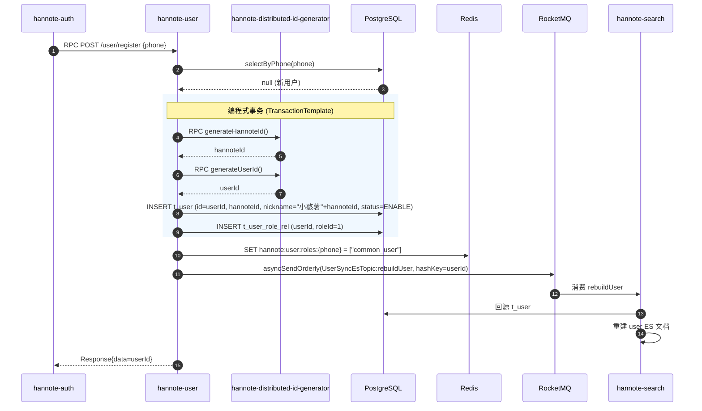
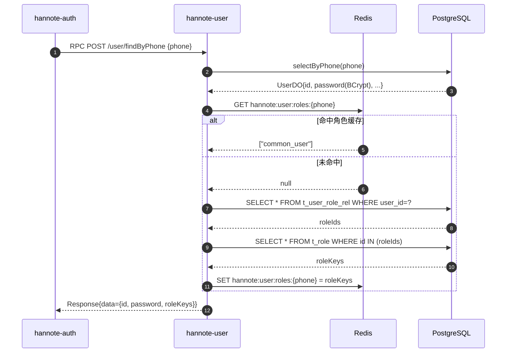
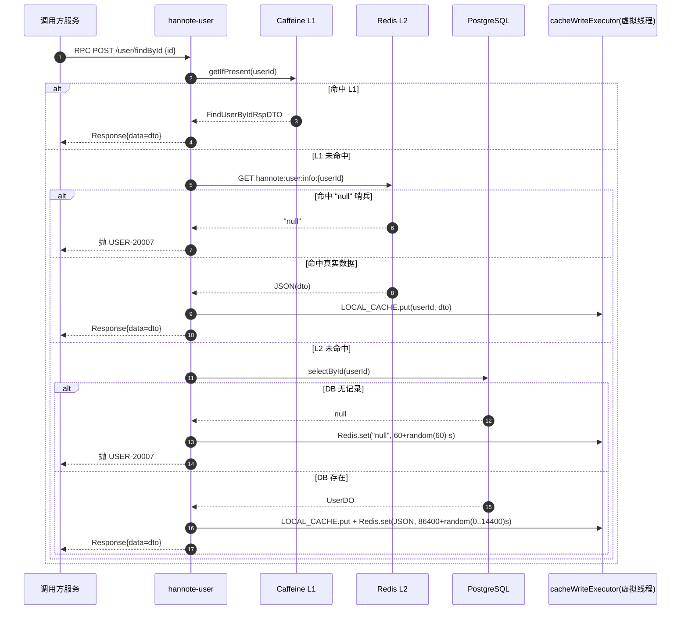
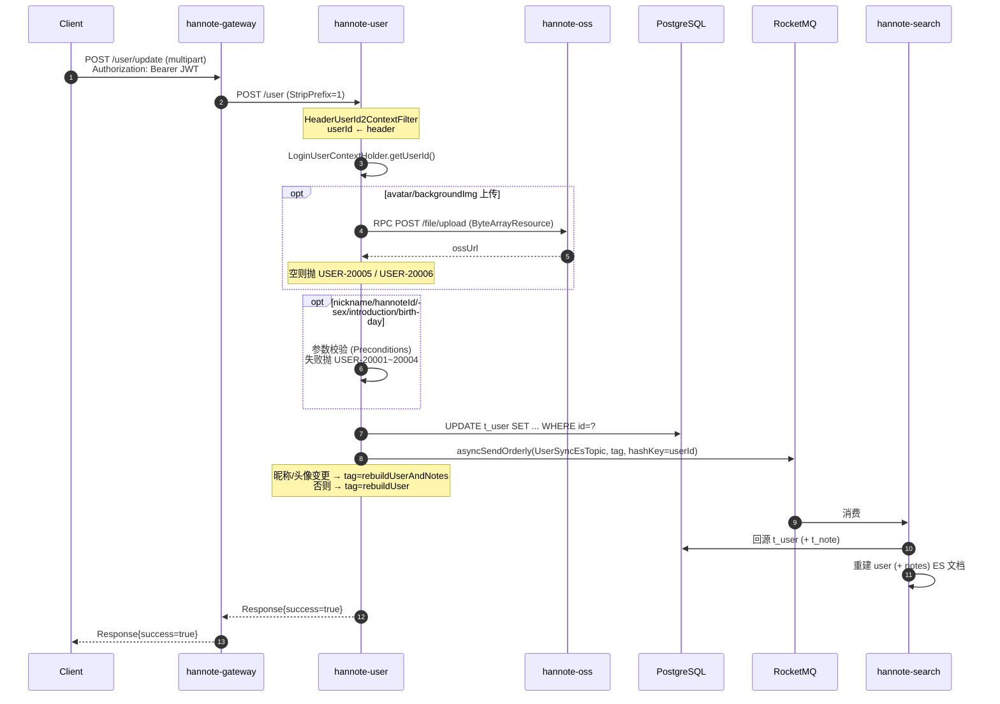
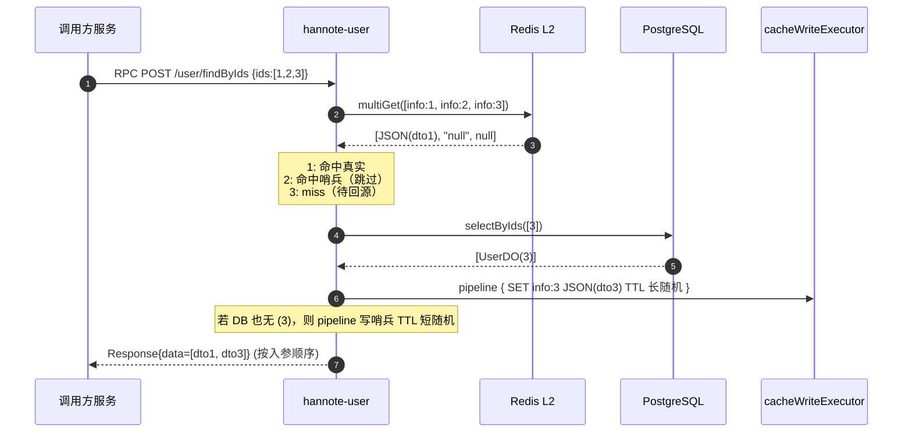
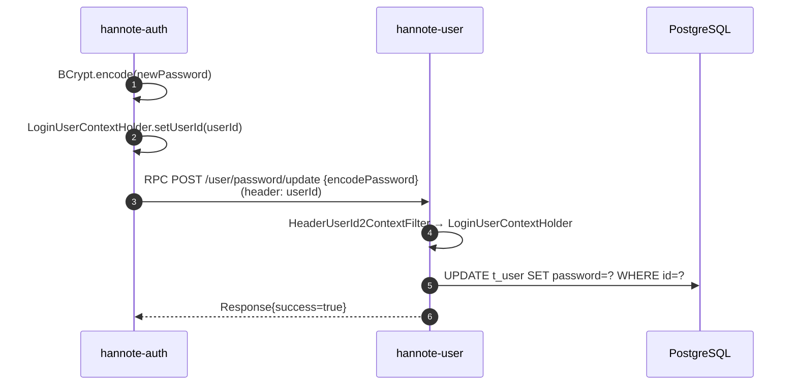

# hannote-user 用户服务

> 服务端口 `8082`，Nacos 注册名 `hannote-user`（namespace=`hannote`，group=`DEFAULT_GROUP`）。
> 本服务是 `t_user` 及角色/权限相关表的**唯一属主**，同时承担其他服务的用户数据供给：`hannote-auth`（登录/注册）、`hannote-note`（笔记详情）、`hannote-user-relation`（关注/粉丝列表）、`hannote-search`（ES 重建）均通过 RPC 调用本服务。

---

## 1. 模块结构

```
hannote-user/
├── pom.xml                              # 聚合 POM（packaging=pom）
├── hannote-user-api/                    # 纯契约模块（jar，供其他服务依赖）
│   └── src/main/java/com/hanserwei/user/api/
│       ├── UserHttpApi.java             # @HttpExchange 接口，5 个 @PostExchange
│       ├── constant/UserApiConstants.java
│       └── dto/{req,resp}/*.java        # 5 个 ReqDTO + 2 个 RspDTO
└── hannote-user-biz/                    # 可运行 Spring Boot 应用（jar）
    ├── Dockerfile                       # 多阶段构建：maven 3.9 + JDK 25 → JRE 25 Alpine
    └── src/main/java/com/hanserwei/user/
        ├── HannoteUserApplication.java  # @SpringBootApplication + @MapperScan
        ├── config/
        │   ├── AsyncConfig.java         # cacheWriteExecutor（虚拟线程）
        │   ├── JacksonConfig.java       # Jackson 3 JsonMapper
        │   ├── RedisTemplateConfig.java # RedisTemplate（String key + Jackson 3 JSON value）
        │   └── RpcClientConfig.java     # @ImportHttpServices 注册 OSS / ID 服务
        ├── constant/
        │   ├── MQConstants.java         # RocketMQ Topic / Tag
        │   ├── RedisKeyConstants.java   # Redis Key 常量
        │   └── RoleConstants.java       # 默认角色 ID=1 / key="common_user"
        ├── controller/UserController.java  # 6 个 POST 端点
        ├── domain/
        │   ├── dataobject/              # UserDO / RoleDO / PermissionDO / RolePermissionDO / UserRoleDO
        │   └── mapper/                  # 5 个 Mapper + XML
        ├── enums/
        │   ├── ResponseCodeEnum.java    # USER-xxxxx 错误码
        │   └── SexEnum.java             # 0=WOMAN 1=MAN
        ├── exception/GlobalExceptionHandler.java
        ├── model/vo/UpdateUserInfoReqVO.java   # multipart 表单 VO
        ├── rpc/
        │   ├── OssRpcService.java              # 对 FileHttpApi 的封装
        │   └── DistributedIdRpcService.java    # 对 DistributedIdHttpApi 的封装
        ├── runner/PushRolePermissions2RedisRunner.java  # 启动时同步角色权限到 Redis
        └── service/{UserService,impl/UserServiceImpl}.java
```

### 关键依赖（`hannote-user-biz/pom.xml`）

| 依赖 | 用途 |
|---|---|
| `hannote-user-api` | 自身契约（Controller 实现 `@PostExchange` 路径） |
| `hannote-oss-api` | `FileHttpApi`（头像/背景图上传） |
| `hannote-distributed-id-generator-api` | `DistributedIdHttpApi`（生成 hannoteId/userId） |
| `hannote-spring-boot-starter-rpc` | HTTP Interface + LoadBalancer + `UserIdRelayInterceptor` |
| `hannote-spring-boot-starter-biz-context` | `LoginUserContextHolder`（TTL） |
| `hannote-spring-boot-starter-biz-operationlog` | `@ApiOperationLog` AOP |
| `mybatis-plus-spring-boot4-starter` + `postgresql` | PG 持久化 |
| `spring-boot-starter-data-redis` + `commons-pool2` | Lettuce 连接池 |
| `rocketmq-spring-boot-starter` | 生产 `UserSyncEsTopic` 通知搜索服务 |
| `caffeine` | L1 本地缓存 |

---

## 2. 接口清单

| # | Method | Path | 访问 | Controller 方法 | 说明 |
|---|---|---|---|---|---|
| 1 | POST | `/user/update` | 网关暴露（`multipart/form-data`） | `updateUserInfo` | 修改用户资料（含头像/背景图上传） |
| 2 | POST | `/user/register` | 内网 RPC | `register` | 用户注册（幂等，自动分配角色） |
| 3 | POST | `/user/findByPhone` | 内网 RPC | `findByPhone` | 按手机号查询（含 BCrypt 密文 + 角色） |
| 4 | POST | `/user/password/update` | 内网 RPC | `updatePassword` | 更新密码（接收已加密的 BCrypt 密文） |
| 5 | POST | `/user/findById` | 内网 RPC | `findById` | 按 ID 查询（Caffeine L1 + Redis L2） |
| 6 | POST | `/user/findByIds` | 内网 RPC | `findByIds` | 批量查询（Redis multiGet + pipeline 回写） |

> 网关路由：`/user/**` → `hannote-user`，`StripPrefix=1`，仅 `POST /user/update` 面向客户端；其余 5 个均为**内网 RPC**，调用方通过 `@ImportHttpServices(group = "hannote-user", types = UserHttpApi.class)` 接入。

---

## 3. 接口详情

### 3.1 `POST /user/update` — 修改用户资料（网关暴露）

**请求**：`multipart/form-data`，`UpdateUserInfoReqVO`（全部可选）
- `avatar`（`MultipartFile`）
- `nickname`（`String`）
- `hannoteId`（`String`）
- `sex`（`Integer`：0 女 / 1 男）
- `birthday`（`LocalDate`）
- `introduction`（`String`）
- `backgroundImg`（`MultipartFile`）

**响应**：`Response<?>`，`success=true`

**注意**：该接口**不加 `@ApiOperationLog`**——`MultipartFile` 流被日志切面序列化会中断请求。

**调用链**：
```
UserController.updateUserInfo
  └─ UserServiceImpl.updateUserInfo
       ├─ LoginUserContextHolder.getUserId()                     → 网关透传
       ├─ avatar       → OssRpcService.uploadFile                → 空则抛 USER-20005
       ├─ nickname     → ParamUtils.checkNickname                → 失败抛 USER-20001
       ├─ hannoteId    → ParamUtils.checkHannoteId               → 失败抛 USER-20002
       ├─ sex          → SexEnum.isValid                         → 失败抛 USER-20003
       ├─ birthday     → 直接设值
       ├─ introduction → ParamUtils.checkLength(100)             → 失败抛 USER-20004
       ├─ backgroundImg→ OssRpcService.uploadFile                → 空则抛 USER-20006
       ├─ UserDOMapper.updateById(UserDO)                        → 任意字段变更时执行
       └─ sendUserSyncEsMq(userId, tag)                          → RocketMQ asyncSendOrderly
             tag = rebuildUserAndNotes (头像/昵称变更)
             tag = rebuildUser          (其他字段变更)
```

**要点**：
- 头像/背景图上传走 RPC `hannote-oss`，非直连对象存储 SDK。
- **昵称或头像变更时 Tag 升级为 `rebuildUserAndNotes`**：笔记索引冗余了 `creator_nickname` / `creator_avatar`，需连带重建该用户全部笔记文档。
- 该接口**不会失效** `hannote:user:info:{userId}` 与 Caffeine L1，最长可能延迟 1 小时（L1）或 1 天+（L2）才在其他服务的查询中体现——属**已知最终一致性取舍**。

### 3.2 `POST /user/register` — 用户注册（RPC，幂等）

**请求体**：`RegisterUserReqDTO { phone: @NotBlank @PhoneNumber }`
**响应**：`Response<Long>`，`data` = userId

**调用链**：
```
UserController.register
  └─ UserServiceImpl.register
       ├─ selectByPhone(phone)                                  → 已存在则直接返回 userId
       ├─ TransactionTemplate.execute():
       │     ├─ DistributedIdRpcService.generateHannoteId()     → RPC hannote-id
       │     ├─ DistributedIdRpcService.generateUserId()        → RPC hannote-id
       │     ├─ UserDOMapper.insert(UserDO{id=userId, hannoteId, nickname="小憨薯"+hannoteId, status=ENABLE})
       │     └─ UserRoleDOMapper.insert(UserRoleDO{userId, roleId=1})
       ├─ 事务失败 → 抛 USER-20008
       ├─ Redis.set("hannote:user:roles:{phone}", ["common_user"])
       └─ sendUserSyncEsMq(userId, "rebuildUser")
```

**要点**：
- 幂等：重复注册直接返回既有 `userId`，不抛异常。
- 默认昵称 `"小憨薯" + hannoteId`，默认角色 `common_user`（`RoleConstants.COMMON_USER_ROLE_ID=1`）。
- 编程式事务保证「入库用户 + 分配角色」的原子性；RPC 调用在事务内执行，失败回滚。

### 3.3 `POST /user/findByPhone` — 手机号查询（RPC，含密文密码）

**请求体**：`FindUserByPhoneReqDTO { phone: @NotBlank @PhoneNumber }`
**响应**：`Response<FindUserByPhoneRspDTO>` — `{ id, password(BCrypt), roleKeys }`

**调用链**：
```
UserController.findByPhone
  └─ UserServiceImpl.findByPhone
       ├─ selectByPhone(phone)                                  → 空则抛 USER-20007
       ├─ loadRoleKeys(phone, userId):
       │     ├─ Redis.get("hannote:user:roles:{phone}")         → 命中直接返回
       │     ├─ UserRoleDOMapper.selectList(userId) → roleIds
       │     ├─ RoleDOMapper.selectByIds(roleIds) → roleKeys
       │     ├─ 空则回退 ["common_user"]
       │     └─ Redis.set(cacheKey, JSON(roleKeys))
       └─ FindUserByPhoneRspDTO{id, password, roleKeys}
```

**要点**：
- 该响应包含 BCrypt 密文，仅对内网 RPC 暴露，**严禁网关路由**。
- `selectByPhone` 使用 `ORDER BY id DESC FETCH FIRST 1 ROWS ONLY`，规避历史脏数据。
- 角色缓存**无 TTL**（持久键），注册时写入、`findByPhone` miss 时回写。

### 3.4 `POST /user/password/update` — 密码更新（RPC）

**请求体**：`UpdateUserPasswordReqDTO { encodePassword: @NotBlank }` — 已是 BCrypt 密文
**响应**：`Response<?>`，`success=true`

**调用链**：
```
UserController.updatePassword
  └─ UserServiceImpl.updatePassword
       ├─ LoginUserContextHolder.getUserId()                    → RPC 入站过滤器注入
       ├─ 空则抛 USER-20007
       └─ UserDOMapper.updateById({id, password, updateTime})
```

**要点**：
- 本服务**不重复加密**，调用方（`hannote-auth`）已 BCrypt 编码后传入。
- `userId` 由 RPC 入站 `HeaderUserId2ContextFilter` 从请求头写回 `LoginUserContextHolder`。

### 3.5 `POST /user/findById` — ID 查询（RPC，二级缓存）

**请求体**：`FindUserByIdReqDTO { id: @NotNull Long }`
**响应**：`Response<FindUserByIdRspDTO>` — `{ id, nickName, avatar, introduction }`

**调用链**：
```
UserController.findById
  └─ UserServiceImpl.findById
       ├─ L1: LOCAL_CACHE.getIfPresent(userId)                  → 命中返回
       ├─ L2: Redis.get("hannote:user:info:{userId}")
       │     ├─ "null" 哨兵 → 抛 USER-20007（防穿透）
       │     └─ 真实数据 → 异步 cacheWriteExecutor 回填 L1，返回
       └─ DB: UserDOMapper.selectById(userId)
             ├─ 空 → 异步 Redis.set("null", 60 + random(60) s)，抛 USER-20007
             └─ 存在 → 构建 DTO
                   └─ 异步 cacheWriteExecutor:
                         LOCAL_CACHE.put(userId, dto)
                         Redis.set(key, JSON(dto), 86400 + random(0..14400) s)
```

**要点**：
- **防穿透**：空值哨兵字符串 `"null"`，短 TTL（1~2 分钟）。
- **防雪崩**：真实数据 TTL 在 `[1 天, 1 天 4 小时]` 内随机。
- **L1 回写**：通过专用 `cacheWriteExecutor`（虚拟线程）异步执行，不阻塞主流程。

### 3.6 `POST /user/findByIds` — 批量查询（RPC，pipeline）

**请求体**：`FindUsersByIdsReqDTO { ids: @NotNull @Size(min=1,max=10) List<Long> }`
**响应**：`Response<List<FindUserByIdRspDTO>>` — 按入参顺序输出

**调用链**：
```
UserController.findByIds
  └─ UserServiceImpl.findByIds
       ├─ Redis.multiGet([hannote:user:info:{id} for id in ids])
       │     ├─ null      → 加入 userIdsNeedQuery
       │     ├─ "null"    → 跳过（命中哨兵）
       │     └─ 真实 JSON → 解析入 userMap
       ├─ 若 userIdsNeedQuery 非空：
       │     ├─ UserDOMapper.selectByIds(...)  (is_deleted=false)
       │     ├─ 回源结果入 userMap + syncUsersToRedis(pipeline, 长 TTL 随机)
       │     └─ DB 亦无的 ID → syncNullValueToRedis(pipeline, 短 TTL 随机)
       └─ 按 userIds 顺序从 userMap 取出，过滤 null 返回
```

**要点**：
- **Redis multiGet 一次往返** 拿所有缓存；**pipeline 一次往返** 回写所有结果。
- 结果保持**入参顺序**，便于调用方按关注时间倒序 / 粉丝时间倒序渲染。
- 同样具备防穿透（批量写哨兵）与防雪崩（随机 TTL）能力。

---

## 4. 数据流转链路

### 4.1 用户注册（auth 服务触发）



### 4.2 手机号查询（auth 登录触发）



### 4.3 findById（二级缓存命中链路）



### 4.4 修改用户资料（含头像上传）



### 4.5 批量查询（pipeline 回写）



### 4.6 密码更新（auth 服务触发）



---

## 5. 缓存层

### 5.1 Caffeine L1（`UserServiceImpl:94-98`）

```java
private static final Cache<Long, FindUserByIdRspDTO> LOCAL_CACHE = Caffeine.newBuilder()
        .initialCapacity(10000)
        .maximumSize(10000)
        .expireAfterWrite(1, TimeUnit.HOURS)
        .build();
```

| 项 | 取值 |
|---|---|
| 容量 | 10,000 条 |
| TTL | 写后 1 小时 |
| 作用范围 | 仅 `findById`（批量走 pipeline，不进 L1） |
| 回填时机 | Redis L2 命中 / DB 回源成功 时异步回填 |

### 5.2 Redis L2

| Key | Value | TTL | 写入方 |
|---|---|---|---|
| `hannote:user:info:{userId}` | JSON(`FindUserByIdRspDTO`) 或 `"null"` 哨兵 | 真实数据 `86400 + random(0..14400)s`（1 天 ~ 1 天 4 小时）<br/>哨兵 `60 + random(0..60)s` | `findById` / `findByIds`（pipeline） |
| `hannote:user:roles:{phone}` | JSON(`List<String>` roleKeys) | 无 TTL（持久键） | `register` / `findByPhone` miss |
| `hannote:role:permissions:{roleId}` | JSON(`List<PermissionDO>`) | 无 TTL（启动时写入） | `PushRolePermissions2RedisRunner` |

### 5.3 缓存回写执行器（`AsyncConfig:28-31`）

```java
@Bean(name = "cacheWriteExecutor", destroyMethod = "close")
public ExecutorService cacheWriteExecutor() {
    return Executors.newVirtualThreadPerTaskExecutor();
}
```

- Java 21+ 虚拟线程，`destroyMethod="close"` 保证优雅停机。
- 承担所有 fire-and-forget 的缓存写入：L1 回填、L2 单条写、L2 pipeline 批量写、空值哨兵写。

### 5.4 防穿透 / 防雪崩

- **防穿透**：`NULL_VALUE = "null"` 字符串作哨兵，命中即抛 `USER_NOT_FOUND`，短 TTL。
- **防雪崩**：真实数据 TTL 在 `[86400, 100800]` 秒随机，避免批量同时过期。
- **批量防穿透**：`findByIds` 对 DB 也无记录的 ID 走 `syncNullValueToRedis` pipeline 批量写哨兵。

### 5.5 失效策略

- **`updateUserInfo` 不失效** L1 / L2 —— 最终一致性取舍。
- **`updatePassword` 不失效** 角色缓存（与密码无关）。
- **角色缓存持久**：`hannote:user:roles:{phone}` 不设 TTL，仅在注册时初始化、miss 时回写。若需动态调整角色，需扩展失效接口。
- **`role:permissions:{roleId}`**：启动时由 `PushRolePermissions2RedisRunner` 全量同步，运行时不失效。

---

## 6. 数据表

### 6.1 `t_user`

- **DO**：`UserDO`；**Mapper**：`UserDOMapper`（`BaseMapper`，无 XML）。
- **主键**：`id`（`IdType.INPUT`，由 `hannote-distributed-id-generator` 生成）。
- **字段**：`id, hannote_id, password(BCrypt), nickname, avatar, birthday, background_img, phone, sex(0/1), status(0 启用/1 禁用), introduction, create_time, update_time, is_deleted(@TableLogic 布尔 false/true)`。
- **索引**：`phone` 唯一索引（推断）。

### 6.2 `t_role`

- **DO**：`RoleDO`；**Mapper**：`RoleDOMapper`。
- **主键**：`id`（`IdType.AUTO`）。
- **字段**：`id, role_name, role_key, status, sort, remark, create_time, update_time, is_deleted`。
- **XML**：`selectEnabledList()` — `WHERE status=0 AND is_deleted=false`。

### 6.3 `t_permission`

- **DO**：`PermissionDO`；**Mapper**：`PermissionDOMapper`。
- **主键**：`id`（`IdType.AUTO`）。
- **字段**：`id, parent_id(树), name, type(1 目录 / 2 菜单 / 3 按钮), menu_url, menu_icon, sort, permission_key, status, create_time, update_time, is_deleted`。
- **XML**：`selectAppEnabledList()` — `WHERE status=0 AND type=3 AND is_deleted=false`。

### 6.4 `t_role_permission_rel`

- **DO**：`RolePermissionDO`；**Mapper**：`RolePermissionDOMapper`。
- **XML**：`selectByRoleIds(List<Long>)` — `WHERE role_id IN (...) AND is_deleted=false`。

### 6.5 `t_user_role_rel`

- **DO**：`UserRoleDO`；**Mapper**：`UserRoleDOMapper`（`BaseMapper`，无 XML）。
- **字段**：`id, user_id, role_id, create_time, update_time, is_deleted`。

---

## 7. RPC 依赖

### 7.1 注册（`RpcClientConfig`）

```java
@ImportHttpServices(group = OssApiConstants.SERVICE_NAME, types = FileHttpApi.class)
@ImportHttpServices(group = IdApiConstants.SERVICE_NAME, types = DistributedIdHttpApi.class)
```

### 7.2 调用矩阵

| 目标服务 | 契约 | Wrapper | 本服务调用点 |
|---|---|---|---|
| `hannote-oss` | `FileHttpApi.uploadFile(Resource)` | `OssRpcService.uploadFile(MultipartFile)` | `updateUserInfo`（头像/背景图） |
| `hannote-distributed-id-generator` | `DistributedIdHttpApi.generateHannoteId/generateUserId` | `DistributedIdRpcService` | `register` |

### 7.3 作为 RPC Server（实现 `UserHttpApi`）

| API 方法 | Controller 实现 | 调用方 |
|---|---|---|
| `register` | `UserController.register` | `hannote-auth`（验证码登录自动注册） |
| `findByPhone` | `UserController.findByPhone` | `hannote-auth`（登录查询） |
| `updatePassword` | `UserController.updatePassword` | `hannote-auth`（修改密码） |
| `findById` | `UserController.findById` | `hannote-note`（笔记详情）等 |
| `findByIds` | `UserController.findByIds` | `hannote-user-relation`（关注/粉丝列表）等 |

---

## 8. RocketMQ 生产者

| Topic | Tag | 顺序性 | 触发点 | 消费者 |
|---|---|---|---|---|
| `UserSyncEsTopic` | `rebuildUser` | `asyncSendOrderly` hashKey=userId | `register` / `updateUserInfo`（仅非昵称头像变更） | `hannote-search.UserSyncEsConsumer` |
| `UserSyncEsTopic` | `rebuildUserAndNotes` | `asyncSendOrderly` hashKey=userId | `updateUserInfo`（昵称/头像变更） | `hannote-search.UserSyncEsConsumer` |

> 配置：生产者组 `hannote_user_group`，发送超时 3000ms，重试 3 次。

---

## 9. Redis 键

| Key | Value | TTL | 写入点 |
|---|---|---|---|
| `hannote:user:info:{userId}` | JSON(`FindUserByIdRspDTO`) 或 `"null"` | 真实 86400+random(0..14400)s / 哨兵 60+random(0..60)s | `findById`、`findByIds` |
| `hannote:user:roles:{phone}` | JSON(`List<String>`) | 无 | `register`、`findByPhone` miss |
| `hannote:role:permissions:{roleId}` | JSON(`List<PermissionDO>`) | 无（启动时同步） | `PushRolePermissions2RedisRunner` |

---

## 10. 错误码（`USER-xxxxx`）

| 枚举 | 错误码 | 文案 | 触发场景 |
|---|---|---|---|
| `SYSTEM_ERROR` | `USER-10000` | 出错啦，请稍后再试~ | 全局兜底；`IllegalArgumentException` / `MethodArgumentNotValidException` 也使用该码（但 message 为具体校验文案） |
| `NICK_NAME_VALID_FAIL` | `USER-20001` | 昵称请设置2-24个字符，不能使用@《/等特殊字符 | `ParamUtils.checkNickname` 失败 |
| `HANNOTE_ID_VALID_FAIL` | `USER-20002` | hannote 号请设置6-15个字符，仅可使用英文、数字、下划线 | `ParamUtils.checkHannoteId` 失败 |
| `SEX_VALID_FAIL` | `USER-20003` | 性别错误 | `SexEnum.isValid` 失败 |
| `INTRODUCTION_VALID_FAIL` | `USER-20004` | 个人简介请设置1-100个字符 | 长度 > 100 |
| `UPLOAD_AVATAR_FAIL` | `USER-20005` | 头像上传失败 | OSS 返回空 URL |
| `UPLOAD_BACKGROUND_IMG_FAIL` | `USER-20006` | 背景图上传失败 | OSS 返回空 URL |
| `USER_NOT_FOUND` | `USER-20007` | 用户不存在 | `findByPhone` / `updatePassword` / `findById`（含哨兵命中） |
| `REGISTER_FAIL` | `USER-20008` | 用户注册失败 | `TransactionTemplate.execute` 返回 null |

> `USER-20001 ~ 20004` 通过 `Preconditions.checkArgument` 抛 `IllegalArgumentException`，由 `GlobalExceptionHandler` 转成 `USER-10000` + 具体文案返回；客户端看到的码是 `USER-10000`，文案才是区分依据。`USER-20005 ~ 20008` 通过 `BizException` 保留原码。

---

## 11. 关键类索引

| 类 | 说明 |
|---|---|
| `HannoteUserApplication` | `@SpringBootApplication` + `@MapperScan("com.hanserwei.user.domain.mapper")` |
| `UserHttpApi` | HTTP Interface 契约，5 个 `@PostExchange` 方法 |
| `UserApiConstants` | `SERVICE_NAME = "hannote-user"` |
| `UserController` | 6 个 POST 端点（1 网关 + 5 RPC） |
| `UserServiceImpl` | 核心业务：注册/查询/改密/修改资料/二级缓存/批量 pipeline/MQ 生产 |
| `UpdateUserInfoReqVO` | multipart 表单 VO（7 个可选字段） |
| `RegisterUserReqDTO` / `FindUserByPhoneReqDTO` / `UpdateUserPasswordReqDTO` / `FindUserByIdReqDTO` / `FindUsersByIdsReqDTO` | 5 个 RPC 入参 DTO |
| `FindUserByPhoneRspDTO` | 敏感响应（含 BCrypt 密文 + 角色） |
| `FindUserByIdRspDTO` | 公开响应（id / nickName / avatar / introduction） |
| `ResponseCodeEnum` | `USER-xxxxx` 错误码 |
| `SexEnum` | 0=WOMAN / 1=MAN |
| `RedisKeyConstants` | 3 类 Key 构建器 |
| `RoleConstants` | `COMMON_USER_ROLE_ID=1` / `COMMON_USER_ROLE_KEY="common_user"` |
| `MQConstants` | `UserSyncEsTopic` + 2 个 Tag |
| `UserDO` / `RoleDO` / `PermissionDO` / `RolePermissionDO` / `UserRoleDO` | 5 张表的 DO |
| `UserDOMapper` / `RoleDOMapper` / `PermissionDOMapper` / `RolePermissionDOMapper` / `UserRoleDOMapper` | 5 个 Mapper |
| `OssRpcService` | `MultipartFile → ByteArrayResource` + `FileHttpApi` 调用 |
| `DistributedIdRpcService` | 封装 `generateHannoteId` / `generateUserId` |
| `RpcClientConfig` | 注册 `FileHttpApi` / `DistributedIdHttpApi` 客户端 |
| `AsyncConfig` | `cacheWriteExecutor` 虚拟线程执行器 |
| `RedisTemplateConfig` | `RedisTemplate<String,Object>`（String key + Jackson 3 JSON value） |
| `JacksonConfig` | Jackson 3 `JsonMapper` 并同步到 `JsonUtils` |
| `PushRolePermissions2RedisRunner` | `ApplicationRunner`，启动时把全量角色权限同步到 Redis |
| `GlobalExceptionHandler` | `BizException` / `IllegalArgumentException` / `MethodArgumentNotValidException` / `Exception` 兜底 |

---

## 12. 配置项

### `application.yml`
```yaml
server:
  port: 8082
spring:
  application:
    name: hannote-user
  threads.virtual.enabled: true
  servlet.multipart:
    max-file-size: 10MB
    max-request-size: 10MB
mybatis-plus:
  mapper-locations: classpath*:/mapper/**/*.xml
  configuration:
    map-underscore-to-camel-case: true
```

### `application-dev.yml`（关键片段）
```yaml
spring.cloud.nacos.discovery:
  server-addr: <nacos>:18848
  namespace: hannote
  group: DEFAULT_GROUP
spring.datasource:
  url: jdbc:postgresql://<host>:5432/hannote
  username/password: <cred>
  hikari: { minimum-idle: 5, maximum-pool-size: 20 }
spring.data.redis:
  host/port/password
  lettuce.pool: { max-active: 200, max-idle: 10 }
rocketmq:
  name-server: <mq>:9876
  producer:
    group: hannote_user_group
    send-timeout: 3000
    retry-times-when-send-failed: 3
```

### `application-prod.yml`

全部凭据经环境变量注入（`NACOS_ADDR` / `PG_*` / `REDIS_*` / `MQ_*`）。

---

## 13. 设计备注

- **唯一属主**：本服务独占 5 张用户域表，其他服务不得直连；所有访问必须走 RPC。
- **RPC-only 接口**：`register` / `findByPhone` / `updatePassword` / `findById` / `findByIds` **不接入网关**，调用方只能通过 `UserHttpApi` 契约内网访问；`findByPhone` 会返回 BCrypt 密文，安全上必须内网隔离。
- **二级缓存**：`findById` 走 Caffeine L1 + Redis L2 + DB 三级；`findByIds` 仅走 Redis L2 + DB（批量场景 L1 命中率低，省去维护成本）。
- **最终一致性取舍**：`updateUserInfo` **不主动失效** `hannote:user:info:{userId}` 与 L1，最坏情况下 L1 1 小时、L2 1 天+ 内其他服务看到的仍是旧资料。业务可接受（用户资料变化低频），换来的是缓存结构极简、无广播 MQ 成本。
- **幂等注册**：手机号已存在则直接返回既有 `userId`，认证侧可无脑调用。
- **事务内 RPC**：`register` 在编程式事务内调用分布式 ID 服务，RPC 失败会回滚本地事务；这是「ID 生成 + 入库」原子性的取舍，若 ID 服务抖动可能回滚，由认证侧重试。
- **默认角色**：新用户固定分配 `common_user`（`roleId=1`），后续扩展 VIP/审核员等角色在 `register` 之外追加流程。
- **MQ 顺序性**：`asyncSendOrderly` hashKey=userId，保证同一用户的重建事件不乱序；不同用户可并发消费。
- **`spring-retry` 警示**：本服务当前**未引入** `spring-retry`；若未来引入，必须在配置中显式 `spring.cloud.loadbalancer.retry.enabled: false`，否则 rpc starter 所需的 `LoadBalancerInterceptor` 将被替换为 `RetryLoadBalancerInterceptor` 导致启动失败（详见 `AGENTS.md` 中 `hannote-comment` 的教训）。
- **文件上传限制**：`MultipartFile` 参数所在的 Controller 方法不要加 `@ApiOperationLog`，避免切面序列化中断请求流。
